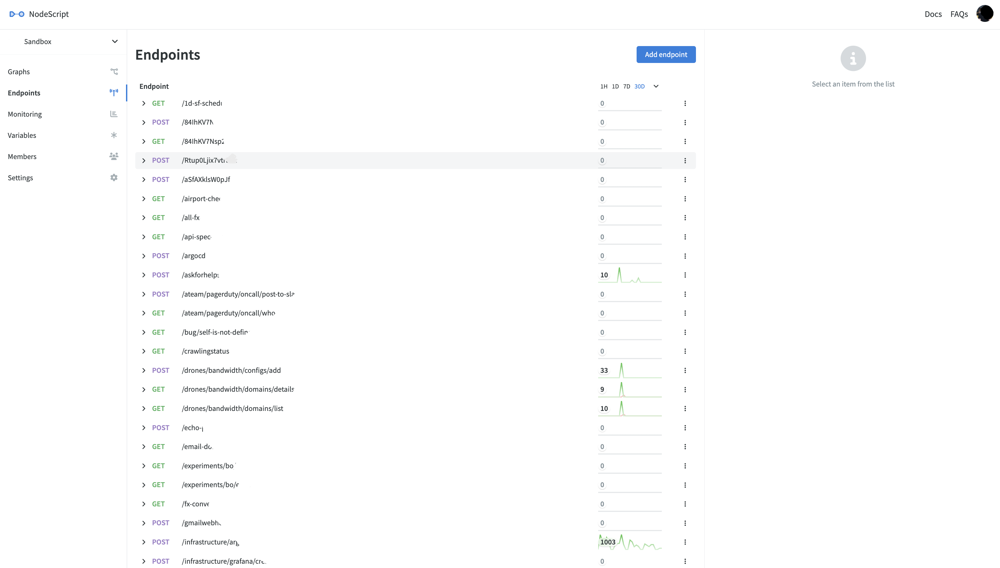

# Endpoints

Endpoints allow your graph to be executed by the outside world. They are the key to your graphs being called by other systems, and then executing. You can build them into your own applications, other no-code tools or distribute them to users to consume how they want.

When you publish an endpoint, it becomes available immediately. We host the code and make it available on the internet for you, similar to AWS Lambda or Google Cloud Run, but without the mess, complicated management and... the need to write code!



There are two ways to publish an endpoint:

 - From your Graph - when you publish a graph, you will be given the option to expose it via HTTP and select a method and URL.
 - From the endpoints page. This gives you a more powerful way of customising your endpoint and also displays all the endpoints for your workspace together in one place.

The easiest way to cut a first draft is from your Graph and then come to the endpoints page to refine it. When editing an endpoint, you can:

 - Change the request method and URI (also commonly called the path name).
 - Update the Graph which this endpoint points to.
 - Change the version of the graph which is executed when the endpoint is called. 

Each endpoint has a few configurable options you should be familiar with:

## URI (path name)

Each workspace has a unique ID and subdomain. This will be in the format:

```
https://<workspace_id>.nodescript.dev
```

When you publish an endpoint, the path name you choose is appended to this. If we name the path `v1/my-endpoint`, your graph will be exposed at:

```
https://<workspace_id>.nodescript.dev/v1/my-endpoint
```

## Request Method

The way you want to consume your endpoint will usually dictate the best request method to use. Using NodeScript, it is very easy to create a [RESTful API](https://www.redhat.com/en/topics/api/what-is-a-rest-api) with JSON.

When your graph has variables, let's say a "user_id" variable, any `GET` endpoints that call that graph can use query parameters to pass the variable, such as:

```
https://xxxxxxx.nodescript.dev/my/endpoint?user_id=me
```

When you use the `POST` method on an endpoint, you can achieve a similar effect with a JSON body:

```
https://xxxxxxx.nodescript.dev/my/endpoint
{
    "user_id": "me"
}
```

## Version

By default, endpoints will be fixed to the `latest` version of your graph, meaning that when you make a change to your graph and publish it, the changes immediately hit the endpoint.

If you are using an endpoint in production then it can be wise to _pin_ your endpoint to a specific version, and then work on an updated endpoint which incorporates your breaking changes.


## Authentication

In the future, you will be able to add authentication strategies to your endpoints to lock them down, but this is currently not available, so do not expose anything private using NodeScript.
