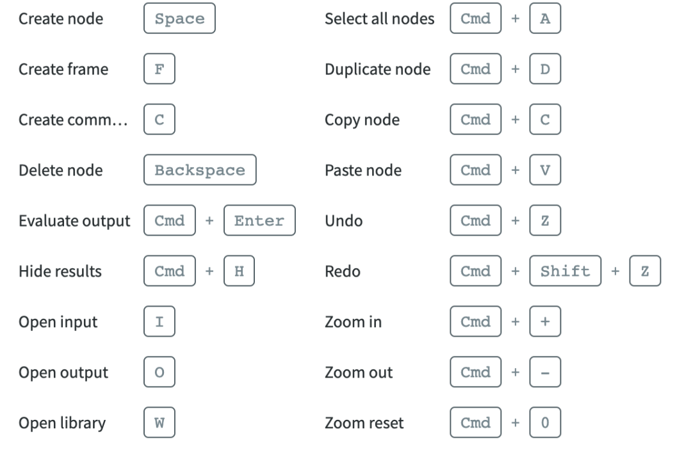
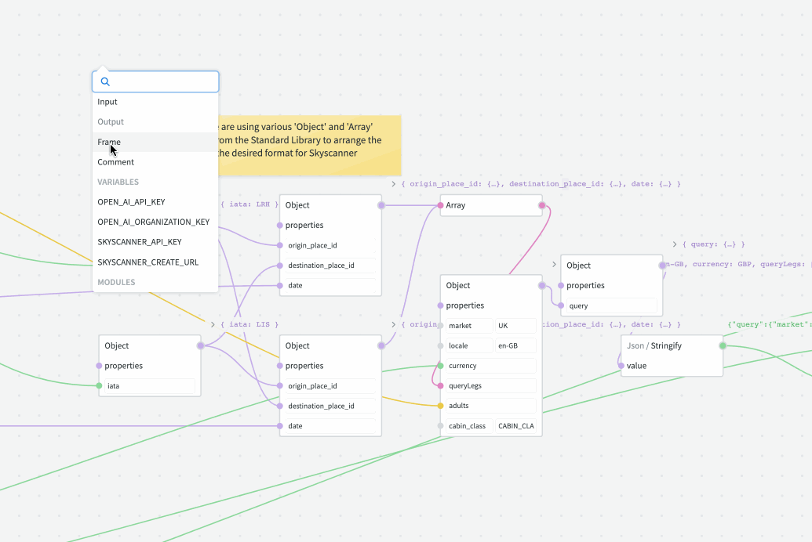
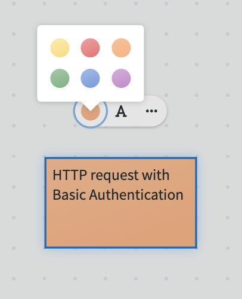

# Graphs

Graphs are our canvas for building things in NodeScript. They can contain many connected [nodes](./nodes.md), each performing a specific task or function. By combining nodes in a Graph, you can build complex applications of your logic. The example below allows you check the sunrise for any given city, try it by changing the value in the "city" input and running the graph by selecting 'play' on the output node.

<iframe width="780" height="420" src="https://embed.nodescript.dev/?graphId=1XHkchnfIBzbNqHn&theme=auto&zoom=0.5" title="Sunrise Set" frameborder="0" allowfullscreen></iframe>

You'll use the Graph to interact with, create, and manage your workflows or applications by linking nodes in different ways. They are infinitely scrollable and are the main place you will interact with NodeScript. You can zoom in and out of the Graph to orientate yourself.

Graphs give you:

 - **Instant Feedback** - graphs are evaluated as you build and the results are displayed immediately.
 - **Composability** - you can combine many Nodes together to build complex functionality.
 - **Reusability** - a Graph can be published as a module, allowing its functionality to be used in other graphs.
 - **Shared Environments** - users share access to, and can work simultaneously on, graphs within the same workspace. 
 
 ## Legend

 Data types within a NodeScript graph are represented in the following colors:

 * Grey - Any
 * Green - String
 * Yellow - Number
 * Blue - Boolean
 * Purple - Object 
 * Pink - Array

  ## Keyboard Shortcuts

 <!-- 
 * Create node: Spacebar/Right Click
 * Delete Node: Backspace
 * Duplicate: Cmd + D
 * Copy: Cmd/Ctrl + C
 * Paste: Cmd/Ctrl + V
 * Select all nodes: Cmd/Ctrl + A
 * Create frame: F
 * Create comment: C
 * Hide results: CMD/Ctrl + H
 * Open Input: I
 * Open output: O
 * Open library: W
 * Undo: CMD/Ctrl Z
 * Redo: CMD/Ctrl + Shift + Z
 * Zoom in: CMD/Ctrl + +
 * Zoom out: CMD/Ctrl + -
 * Zoom reset: CMD/Ctrl + 0
-->

## Frames
Frames serve as an additional layer of organization for managing multiple nodes simultaneously. Think of a frame as a flexible boundary that binds together a collection of nodes. When you group nodes into a frame, they effectively behave as a single unit, streamlining various operations and visualizations.

**Create a Frame:** Right-click on the canvas area where you'd like to add a frame. From the contextual menu, select the "Add Frame" option. This action will spawn a freely sized container, which you can adjust according to your needs.

**Populating the Frame:** Drag and drop nodes into the frame. Once a node is within the frame's boundaries, it becomes a part of that frame. This allows users to effortlessly group related nodes together, enhancing clarity and organization.

**Moving the Frame:** One of the primary benefits of frames is the ability to move multiple nodes simultaneously. Click anywhere on the frame's border or background, then drag. All nodes within the frame will move in unison, retaining their relative positions inside the frame.

## Comments

Comments are unique items that help users annotate, provide feedback, or jot down thoughts directly within the node-based workspace. While they are added similarly to nodes, their appearance and functionality closely resemble "post-it" notes, ensuring they stand out and offer a more informal, flexible method of communication.

### How to Add Comments
Right-click and select 'Comment', then type your note. Once finished, click outside the comment or press 'Enter' to save.

### Interacting with Comments

* **Moving:** Click and drag the comment to your desired location on the canvas, just as you would with a node or post-it note.

* **Editing:** Double-click on the comment to modify its content.

* **Resizing:** Hover over the edges of the comment and drag to adjust its size.

* **Deletion:** Right-click on the comment and select 'Delete' or click on a trash bin icon

* **Recolor:** Change the color of a comment by selecting the color from the context menu.

### Best Practices for Commenting
**Clarity:** Always write clear, concise comments to ensure they're easily understood by others and future you.

**Regular Cleanup:** As tasks are completed or issues are resolved, regularly review and remove obsolete comments to maintain a clutter-free workspace.

**Collaborative Etiquette:** When working in teams, always be respectful and constructive with your comments.