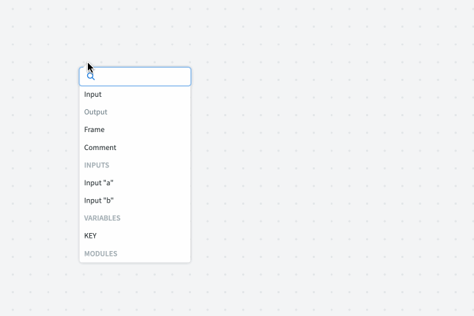
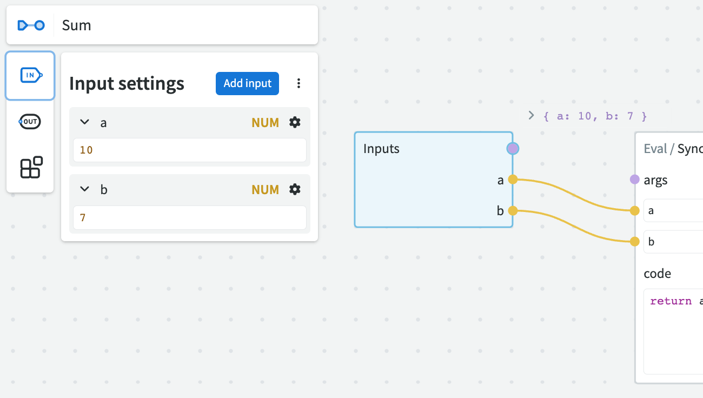
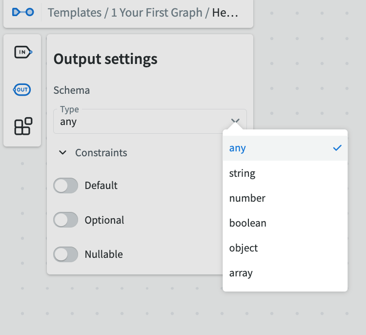
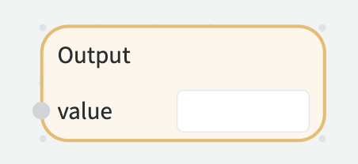
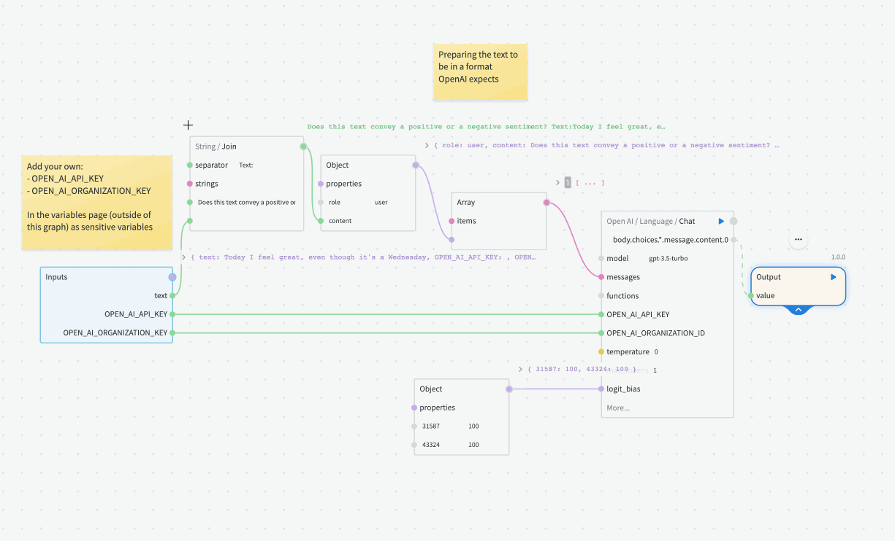

# Nodes

Nodes are the basic building blocks of a graph. A node on its own is comparable to a function and can be connected to each other using their _sockets_ to put together more complex logic.

Each node performs some logic to produce an output. Most nodes also have inputs that determine the output (similar to _variables_). Consider a `Sum` node that adds two numbers together (`1` (a) + `7` (b)), this would produce an output of `8`. These are represented by sockets on the Node itself, with inputs on the left and the output on the right.

In this example, our node is `Eval` which allows us to write some JavaScript which processes our inputs.

## Types of Nodes

There are two types of Nodes that you should understand the difference of:

 - **Standard Library** - these nodes cannot have their behaviour changed, they are provided by NodeScript. They provide the foundation to build more complex graphs.
 - **Modules** - these are covered in more detail [here](./modules.md), but succinctly they are ways of calling other graphs that perform their own logic.

## Adding Nodes to a Graph

When you are editing a graph, press spacebar or right click to open a menu that shows all the nodes that you can add to the canvas. You can use the search function or scroll within the menu to find the node you'd like to add.

### Resizing
A node can be resized by moving the cursor to the edge of the container and click dragging it to the desired dimension. 

### Items
Items can be added to or removed from certain Node types by clicking the "+" or "x" icon respectively from the right hand side of the container. 
Items can also be re-ordered via the arrows to the right of each item (see gif above).

## Inputs and Outputs

In the realm of NodeScript, two primary components drive the flow of data: Inputs and Outputs.

Inputs: Think of inputs as the starting point or the initial data that a graph receives. Just like how a function in programming takes parameters to process and compute results, a graph in NodeScript uses inputs to initiate its logic. They provide the necessary information that nodes within a graph need to perform their individual and collective tasks.

Outputs: Once the data has been processed through the interconnected nodes, the final result or conclusion of this process is represented by outputs. If inputs are the questions we pose to a graph, outputs are the answers it provides. These can be viewed as the return values in traditional programming functions, giving a clear end to the logic applied on the input data.

With this foundation in mind, let's dive deeper into how inputs and outputs work in NodeScript, and how they play a pivotal role in connecting, modularizing, and creating intricate data flows.

## Inputs

Inputs are the initial data or values fed into a graph to influence its behavior and computations. They serve as the starting point, much like parameters or arguments in traditional function calls. Configuring these inputs is facilitated through the Input Settings menu, a user-friendly interface located at the top left of the canvas.

NodeScript's flexibility extends to datasets within the Input Settings menu, allowing users to switch between various preset values easily, optimizing efficiency and versatility in graph interactions.

Our example above has two inputs, 'a' and 'b', with a value of 1 and 7 respectively (defined in the Input Settings menu):

 Within this menu, users can define multiple inputs, set types, and assign values, offering a tailored experience for each node's requirements: 

### Input Nodes

Input nodes are specialized nodes designed to serve as primary data entry points in a graph. Their role is to introduce data into the system, acting as a gateway for external information. When a graph is encapsulated as a module or when it's designed to be embedded within a larger system, input nodes become essential. 

Visually, input nodes identified by their blue colors. They often lack the input sockets since their primary function is to introduce new data rather than process existing data. A new input node to the canvas it will inherit the values assigned in the Input Settings menu.

For users looking to craft intricate and interconnected systems, understanding and effectively utilizing inputs and input nodes is paramount. They form the foundation of data-driven logic and operations within NodeScript's dynamic environment.

### Datasets

Datasets can also be added in the Input settings menu. This allows different values to be added to the inputs and changed between freely.  datasets in NodeScript act as predefined sets of input configurations, enhancing the flexibility and efficiency of working with graphs. They are particularly useful in scenarios where a graph needs to be tested or operated with multiple sets of input values.

This functionality is set up so that you always have the same inputs (like 'a' and 'b') for all your datasets, but you can change their values however you want.

**For example**, let's say you're trying to find out the sunset and sunrise times for specific locations, like Lisbon and London. You would use latitude and longitude as your inputs. You can save the latitude and longitude for Lisbon in one set, we'll call this 'Dataset 1'. Then, you can save the latitude and longitude for London in another set, which we'll call 'Dataset 2'.

This way, you don't need to keep looking up and copying the coordinates for these places each time you want to check the sunset and sunrise times. You just switch between 'Dataset 1' for Lisbon and 'Dataset 2' for London, and the system uses the right coordinates automatically.

## Outputs

Output nodes are essential for the functionality and versatility of a graph within NodeScript. While each node within a graph can produce outputs, the designated output node plays a special role by acting as the final result or conclusion of the graph's entire logic. Think of the output node as the returned value in traditional functions. By producing a definitive result, it provides a clear endpoint or outcome from the interconnected series of operations performed by the graph's nodes.

The presence of an output node also paves the way for a graph to be published and exposed as a module. By exposing this endpoint, the graph can be seamlessly integrated into other graphs, essentially allowing one graph to utilize the logic and functions of another. This modular approach elevates the power and flexibility of NodeScript, allowing for complex logics to be modularized, reused, and combined.

**To publish a graph and make it available as a module for other graphs, an output node is mandatory.** 

This requirement ensures that every module has a clear and consistent interface, which other graphs can reliably connect to and obtain results from.

Similar to inputs, outputs can be defined in the Output Settings menu, in which the Schema type can be assigned along with other constraints:

### Output Nodes

The output node can be easily identified by the curvature of its edges and its yellow colour. To use the graph as a module in another graph, simply connect to the output node's socket, and you'll receive the computed results based on the graph's logic and any provided inputs.

Remember, while many nodes display their output above the top right of the container, the designated output node stands as the ultimate result of the entire graph. It's the bridge that allows one graph to communicate its results to another, ensuring a smooth and efficient workflow within NodeScript.

Note: For detailed guidelines on how to designate an output node and publish a graph as a module, refer to the [Modules](./modules.md) section.

## Interacting with JSON results

**Result Display on Nodes**
In our platform, nodes aren't just passive entities; they actively display results, enhancing user interaction and feedback. When a node processes data or makes a request, the outcome is conveniently displayed above its top right corner. This feature ensures that users can immediately see the outcome without navigating away from the node itself.

**Interacting with JSON Responses**
For nodes that yield JSON responses:

1. **Interactive JSON**: Unlike static display formats, JSON results on our platform are fully interactive. Each key-value pair, array item, or nested object in the JSON can be individually engaged.
 
2. **Data Filtering**: If you're dealing with extensive JSON data and are interested in specific items, you don't have to comb through the entire result. Simply click on the desired value or section within the interactive JSON display. The system highlights your selection, allowing for focused analysis.

**Enhancing Requests with Data Selection**

1. **Incorporating JSON Values into Requests**: Once you've made a selection within the JSON result, the platform offers a unique drag-and-drop feature. You can open the response, then click-drag a specific value or item from the JSON.

2. **Populating the Request Node**: By dragging the selected value, move it towards the 'Request Node' on your canvas. As you release your selection, NodeScript will automatically integrate the selected value to request node and creating an output connector.

## Subgraphs

Subgraphs allow you to encapsulate or group multiple interconnected nodes into a single, unified node for the sake of clarity, organization, and efficiency. 

To create a Subgraph, select the all the nodes you wish to include, either via click drag or my holding CMD/Ctrl and clicking on each one, then right click and select "Convert to subgraph" from the menu.

Upon confirming the action, the selected nodes and their interconnections will be merged and represented as a single, distinct node, now referred to as a 'Subgraph'.

### **Benefits of Using Subgraphs**:

- **Clarity**: Subgraphs help reduce visual clutter by encapsulating multiple nodes into one, making the primary graph more readable and navigable.
  
- **Modularity**: With subgraphs, specific functionalities or processes can be isolated, making it easier to replicate, move, or modify them as a singular unit.

- **Reusability**: Once defined, subgraphs can potentially be used in multiple places within the main graph or even across different projects, promoting a modular design approach.

- **Error Isolation**: If there's an issue within a subgraph, it's contained, preventing it from directly affecting the larger graph and making troubleshooting more efficient.

Using subgraphs can drastically improve the efficiency and organization of your workflow, ensuring that even the most complex processes remain manageable and understandable.