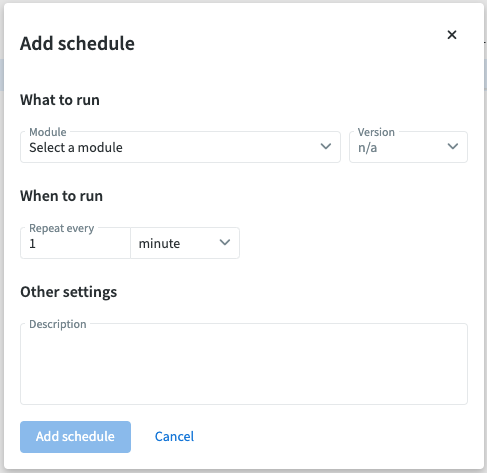

# Schedules

In NodeScript, schedules are a way to automate the execution of your graphs based on specific time intervals or predefined schedules. This feature is particularly useful for tasks that need to run periodically, such as data synchronization, automated reporting, regular API polling, or any other time-based automation processes. 

The Schedules page lists all your existing (if you have any) schedules, including their name, recurrency, status (from last executed) and a time adjustable monitoring graph. The right hand sidebar will display information of the currently selected schedule.

## Add a new Schedule

To set up a new Schedule, navigate to the "Schedules" tab in the left sidebar and select "Add schedule" from the top right corner. 

The dialogue that triggers will prompt you to input what to schedule (which module) and when (how often) to run it. All your published Modules will be available in the dropdown as well as the individual versions for each one.

***Note: Only the active user's published modules will be available to schedule. The same as creating an endpoint.***

To create your schedule, select the module and the version of it you wish to schedule from the "What to run" section dropdowns. Then, select the frequency at which you wish to execute it from the "When to run" options. 

The most a module can be executed is once every minute (by adding a value of "1" in the "Repeat every" field and selecting "minutes" from the drop down).

A description may also be added that will be displayed in the right sidebar when the specific schedule is selected. 

## Action menu

Right clicking on a schedule from the list will open the action menu. This menu allow you to:
* Navigate directly to the graph it is triggering, 
* Temporarily disable the schedule
* Force the graph to run now
* Permanently delete the schedule