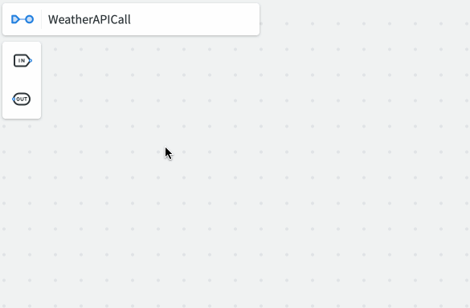
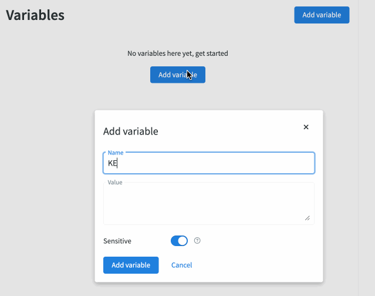
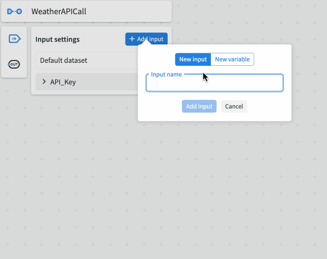
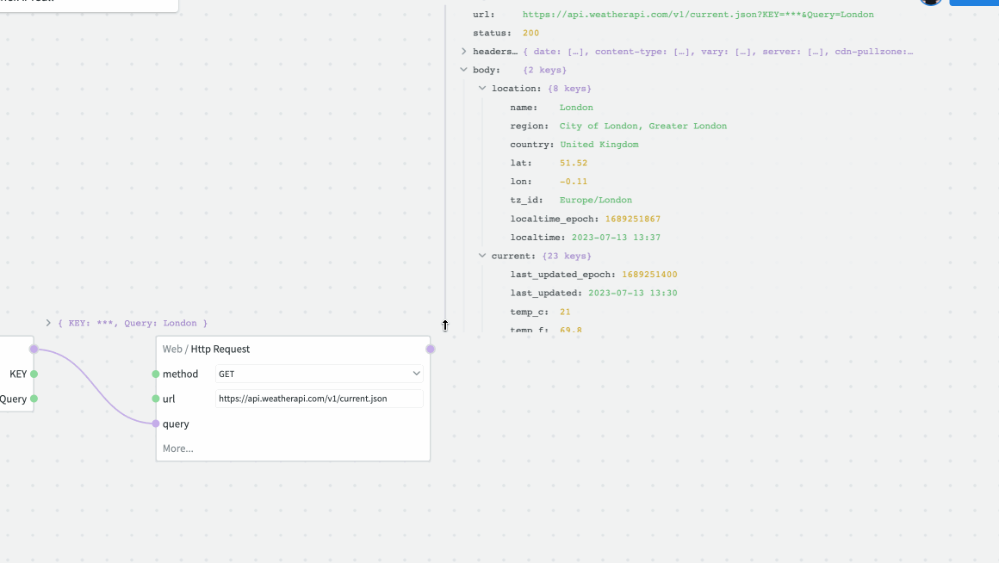
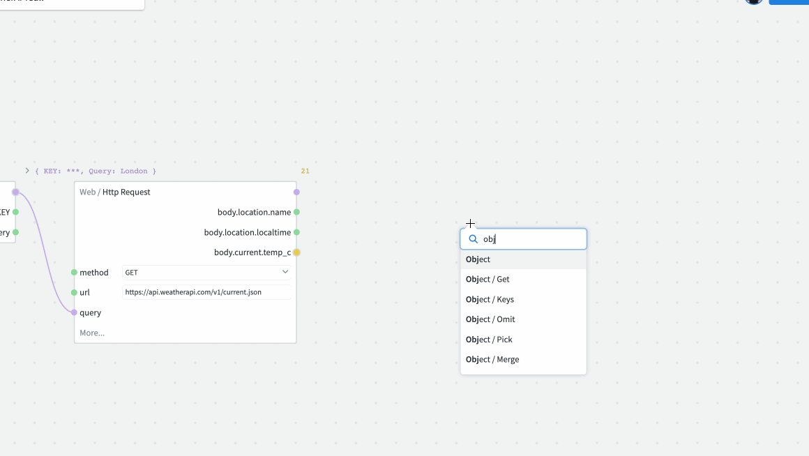

# Tutorials

Here you will find step by step guides of increasing complexity, designed to get you used to the basic functions and features of NodeScript.

## Building Your First Graph 

In this first tutorial, we'll walk you through creating a simple NodeScript graph that fetches and presents weather data using a GET request. This will help you get familiar with NodeScript's interface and node connections.

Ensure you're logged into [NodeScript](https://nodescript.dev/) before you begin.

### Step 1: Get an API Key

To fetch weather data, you need an API key from a weather API provider. There are several to choose from, like WeatherAPI or Weatherbit. For this tutorial, we'll use [WeatherAPI](https://www.weatherapi.com/signup.aspx). Just follow their instructions to sign up for a free API key.

### Step 2: Create a New Workspace

Navigate to the NodeScript dashboard and click on "Create Workspace" from the menu and name this workspace "WeatherBot".

### Step 3: Create a New Graph

Inside your "WeatherBot" workspace, click on "New Graph" at the top. A new graph will appear - go ahead and rename it to "WeatherAPICall".

### Step 4: Store Your API Key as a Variable

Now, click on the NodeScript icon next to your graph's title (this is how to navigate back the dashboard from anywhere in NodeScript), and select "Variables" from the menu. 

Once there, open the variable tab and add a new variable. Name it "KEY" and put your WeatherAPI key in the Value field.

### Step 5: Set up the inputs for the GET request

Back in our graph - We need our key and a query as inputs for our request. To define our inputs select the IN icon in the top left of the canvas. 

First, we will add our API key - Add input > New variable > select your newly created variable from the list. 

The query, which will be used to select the location of the weather we see - New input > Name it “Query” > make it type "String" and finally add your default value in JSON format, for our tutorial we will use "London". Feel free to experiment with this later.

Now right click on your graph and select "Input" to add it.

### Step 6: Make the GET request:

We are now ready to make our HTTP GET Request and give it the approriate parameters to give us the weather in London. 

Add a "Web / Http Response" node to the graph. The default method will already be GET, which is what we need. Add “https://api.weatherapi.com/v1/current.json” to the URL field. 

Finally, select the "more..." option in the node, select "query" and connect your input node to the query connector.

Now we have successfully made an API call and pressing play will show us the results above the request node. However, we don't want all of this data, we want to filter it to just the important parts to our users. 

### Step 7: Filter the JSON Data

The API call will return a JSON response. However, we only need certain bits of this data. To extract those, expand the JSON response by expanding the JSON and dragging each value you want out of the JSON container. The value will automatically snap to your request node as a property for later use.

Let's take the location name, local time and current temp from the response body, like so:

### Step 8: Create the Output

Our final step is to create our graph's output. To do this we need to combine our 3 result properties into a single object and feed it to an output node.

Add an "Object" node to the graph and use the '+' icon to add 3 properties to it. Name each property and connect them accordingly.

Create an "Output" node and connect your object to it and we're finished!

Feel free to play around by changing the default value in your "Query" to see weather data for other locations!

Now that you've built your first NodeScript graph, you're ready to take on more complex workflows. 

<!--- ## Creating Advance Workflows

Great job on creating your first graph with NodeScript! In this advanced tutorial, we'll take it a step further by building a Weather Forecast Bot. It will provide weather forecasts for different times and places, all retrieved via API calls.

Before we start, ensure you're logged into [NodeScript](https://nodescript.dev/) and have your WeatherAPI key ready.

### Step 1: Set Up Your Workspace and Graph

If you haven't already, create a new workspace called "AdvancedWeatherBot". In this workspace, create a new graph named "ForecastAPICall".

### Step 2: Store Your API Key

In the Variables section (which you can access from the icon next to your graph's title), create a new variable named "API_KEY". Enter your WeatherAPI key as the value.

### Step 3: Create Your GET Request Inputs

Return to your graph and add two input nodes. Name one "Query" (the location) and the other "Days" (the forecast length). For the "Query" node, set the type to "STRING" and use "London" as the default input. For the "Days" node, set the type to "NUMBER" and use "3" as the default input.

Now, add an "Object" node with properties called "Key", "Query", and "Days". Connect the corresponding nodes to these properties.

### Step 4: Fetch the Forecast

Add a "Web/HTTP Request" node and set "GET" as the method. Enter "https://api.weatherapi.com/v1/forecast.json" into the URL field. Click on "more" at the bottom of the node and select the "Query" option. Connect your Object node to this input.

Press play, and the API call will return a JSON response with forecast data for the next few days in London.

### Step 5: Filter the Data

Expand the JSON response and find the "forecastday" array, which contains a forecast for each day. For each day, we want the "date", "avgtemp_c", and "condition:text" values.

Add a "Map" node and connect the "forecastday" value from the JSON to the "Array" input. Inside the Map node's "Function" input, create an "Object" node with "date", "avgtemp", and "condition" properties. 

### Step 6: Create the Output

Connect the values mentioned above (from inside the Map node) to the corresponding properties in the Object node. Then, create an "Output" node, and connect the Map node to it.

Press play, and there you have it! You'll see the average temperature and weather condition for the next few days in your chosen location.

Play around with different values for "Query" and "Days". You'll see that your Weather Forecast Bot can provide forecasts for any location and any number of days you want. That's the power of NodeScript and your creativity combined! Keep exploring and see what else you can build.
--->