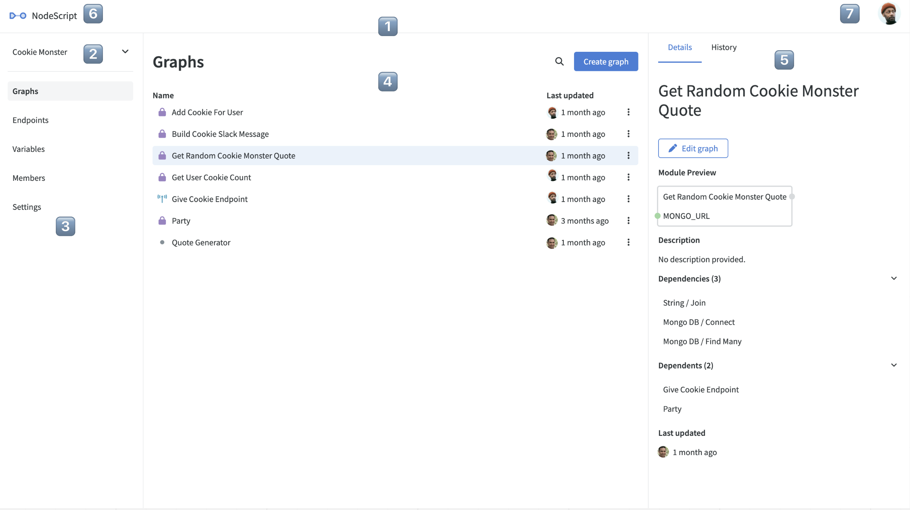

# Getting started

Welcome to the Getting Started page! In this section, we'll explore the layout and navigation of NodeScript. 

NodeScript requires no dependancies, configuration or installation, and will run on any browser.

## Sign in

At the moment, NodeScript only supports sign in with GitHub, but we're working on adding more options soon. For now, all we need is your email address, which we'll get through GitHub authentication.

To signin using GitHub, just click on the option in the top right corner of the landing page and authorize NodeScript to access your GitHub account.

## Dashboard

The Dashboard is the first page you will see when signing in to NodeScript, it provides an overview and details of the currently selected workspace (1). You can choose from all available workspaces you have access to using the dropdown menu (2). Whenever you select an item from this page, its relevant information appears in the container to its right.

For example, when you click on Graphs in the left container (2), a list of all saved graphs in the current workspace will be displayed in the center container (3). Then, if you select a graph from this list, its data will be shown in the right container (4).

**Dashboard elements:**
- 1 - Current workspace: Displays details and options related to the selected workspace
- 2 - Workspace selection menu: A dropdown menu featuring all workspaces you have access to
- 3 - Workspace navigation: Provides menu options and settings for the active workspace
- 4 - Center container: Shows the content related to the selected option from the workspace navigation menu (3)
- 5 - Right container: Displays information and data for the item currently selected in the center container (4)
- 6 - Home: Click the icon in the top right to return to or refresh the Dashboard
- 7 - User settings: Offers sign-out and profile options

