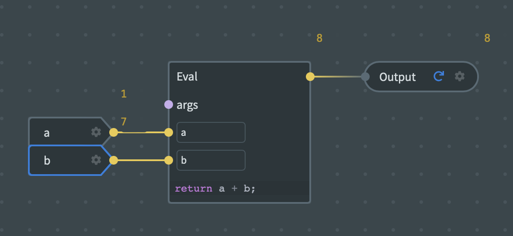
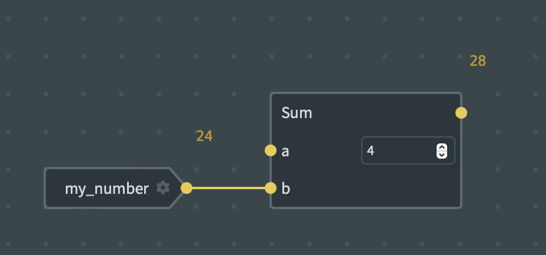

# Modules

If your graph contains an output node, you can expose it as a _module_. Generally, a module will contain some input(s) as well, but this isn't always the case. Graphs do not by default make themselves available as a module, they need to be explicitly published as one.

Publishing a graph as a module means that this graph can be consumed in _another_ graph. When publishing a module you can choose between exposing it:

 - **Privately** - this allows other graphs **in the same workspace** to use its functionality. This is really useful when creating larger graphs that become complicated or for building small, reusable, parts of a bigger system that benefit from [DRY principles](https://en.wikipedia.org/wiki/Don%27t_repeat_yourself).
 - **Publicly** - this allows you to expose your modules to any other workspaces, including ones that you are not a member of, so that they can use what you have built (you can also use public modules in your graphs!).

In the future, we plan on adding support for publishing modules in a third way - allowing them to be consumed only in allowed workspaces, so that you can build modules and share them across logical boundaries (workspaces) in different contexts but in a related domain.

Let's take our sum graph as an example, which looks like this:

When we expose this as a _module_, a different graph can consume it like this:

Now the complexity of the module is hidden and we only need to deal with the input and output, which can then be plugged into our own set of values.
