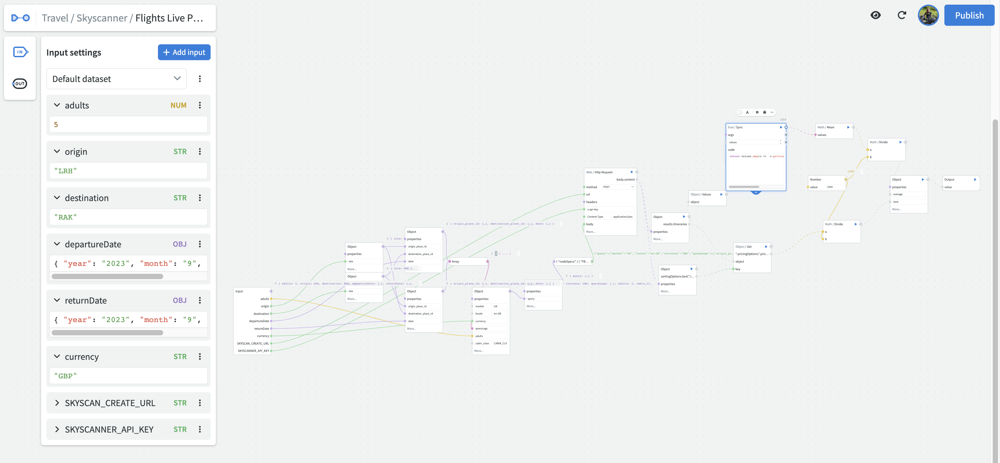

# Introduction

Welcome to NodeScript, a platform designed to streamline workflow automation and API integration processes. With NodeScript, you can effortlessly connect APIs and online services without the need for extensive coding knowledge.

The visual interface allows you to easily design, manage, and maintain complex workflows that can be shared and collaborated on across teams. NodeScript aims to simplify intergrarion and automation process, making it more efficient and accessible for all users.

## How does it work?

At its core, NodeScript is a node-based visual programming language that enables users to create flow-based [graphs](./graphs.md), which can then be executed in real-world scenarios through an [endpoint](./endpoints.md).

The functionality and scope of your graph are entirely up to you. NodeScript offers an infinitely scalable canvas that can accommodate as many [nodes](nodes.md) as you need!

### Key Features & Capabilities: ###

- Always ready - no setup needed
- Always running - no hosting required
- Immediate feedback without deployment
- Collaborative environment for team projects
- Composable elements for versatile creations

### Why NodeScript? ###

- Real-time results - see the outcomes as you develop
- Speed - at scale, it's faster than traditional coding
- Atomic design - modular components for flexibility
- Instant work and deployment - save time and effort
- Automated API calls - no more manual interventions
- Accessibility - suitable for developers of all skill levels

Lets dive into some of concepts and features you will find in NodeScript...