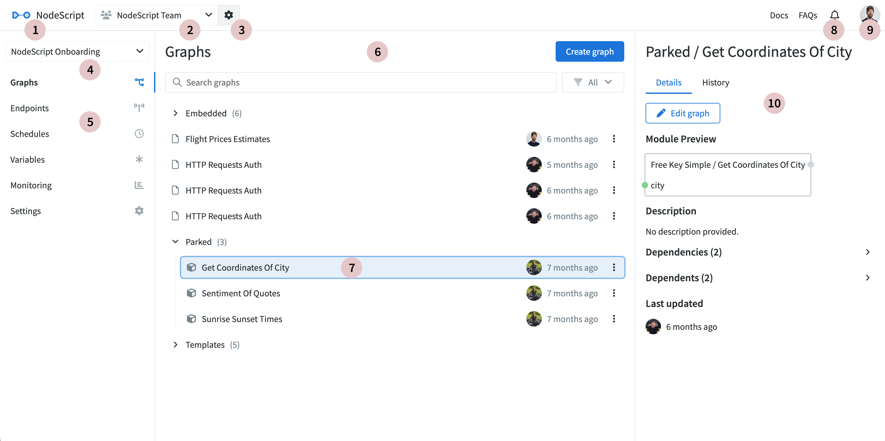

# Getting started

In this section, we'll explore the platform's layout and how to navigate the dashboard. Firstly, NodeScript requires no dependencies, configuration or installation, and will run in any browser.

## Sign in

All we need is your email address, which we'll get through GitHub or Google authentication.

To sign in through either of these platforms, just click on the option from the login page and authorize NodeScript to access your account. 

Only your email will be collected.

### Magic Link

Magic Link sign in also available. Enter your email and click the "Sign in with Magic Link" button on the login page to send an email containing a unique link for you to login with. This link will be valid for 1 hour after sending. 

This passwordless process must be repeat on each sign in.

## Dashboard

The Dashboard is the first page you'll see when signing in to NodeScript. It provides an overview and details of the currently selected workspace (1). You can choose from all available workspaces you have access to using the dropdown menu (2). Whenever you select an item from this page, its relevant information appears in the container to its right.

For example, when you click on Graphs in the Workspace navigation (3), a list of all saved graphs in the current workspace will be displayed in the center container (4). Then, if you select a graph from this list, its data will be shown in the right container (5).

**Dashboard elements:**
- 1 - Home: Click the icon in the top right to return to or refresh the workspace.
- 2 - Organisation selection: A dropdown of all the organizations you have access to.
- 3 - Organisation settings: Edit the name, members, workspaces and billing information of the organization.
- 4 - Workspace selection menu: A dropdown menu featuring all workspaces you have access to within the selected organization.
- 5 - Workspace navigation: Lists the pages and features within this workspace.
- 6 - Center container: Shows the content related to the selected option from the workspace navigation menu (5)
- 7 - List items: Most pages are lists (Graphs, endpoints, Variables etc) click on an item to open it or right click to view the action menu.
- 8 - Notifications: Alerts and news from all areas of NodeScript that concern you and your content.
- 9 - User settings: Offers sign-out and profile options
- 10 - Right container: Displays information and data for the item currently selected in the center container (6)

