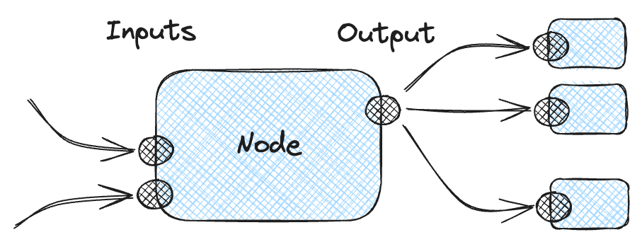
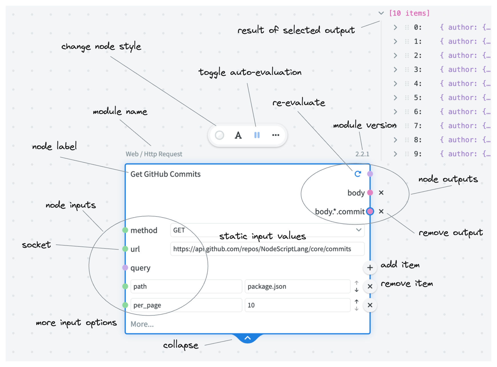
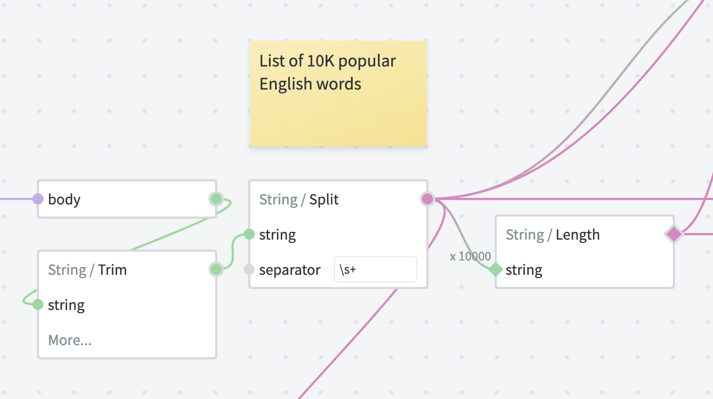
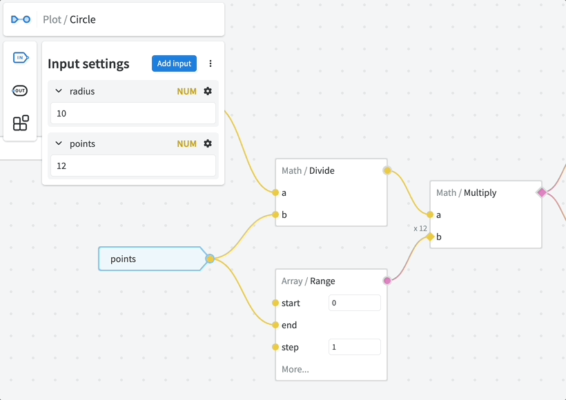

# Graph Anatomy

In this section we'll take a look at various graph features.

## Nodes

Nodes are the basic building blocks of a graph.

The core premise of node-based visual programming is: each node does one specific thing and produces an output, which can be used as an input to other nodes. By connecting multiple nodes together it is possible to build arbitrarily complex logic.

<figure style="display: flex; justify-content: center">
    
</figure>

### Modules

Every node is powered by a specific _module_. A module dictates which inputs are supported and how is output calculated.

One simple way of thinking of those is: modules are functions, and each node is a function call with specific arguments.

### User Interface

Select a node to access all its features.

Note: in order to minimise the visual noise most non-essential UI elements are hidden when the node is not selected.

**Noteable UI features**

- When an input has <code style="color: var(--color-type-array-alt)">array</code> or <code style="color: var(--color-type-object-alt)">object</code> type, a <kbd>+</kbd> button appears on the corresponding line — this allows adding one or more items to that array or object. Each item will have its own socket, so every item can be evaluated differently. However, it is also possible to plug a value into the "parent" array/object as well (in which case the individual items will disappear and will no longer evaluate).

- When a node has a custom label, its module name is displayed outside of the node frame when the node is selected.

- It is possible to change the node label by double-clicking it, or by pressing the <kbd>A</kbd> button on the node toolbar.

- Node output result is displayed near the top right corner of the node. If the node has more than one output, the result of the selected output socket is displayed. It is possible to change the displayed output simply by clicking the corresponding socket.

- You can add node output either by "dragging out" a value from the result, or by right-clicking the node and clicking "Add node output". The latter method also allows you to specify the output key to use.

- Sometimes nodes have additional inputs (also known as "advanced"). Those are hidden by default and can be added by clicking <kbd>More...</kbd>. For example, a lot of the features of Http / Request node are hidden by default.

## Frames

Frames provide a way to logically group a number of related nodes. When the frame is moved, all nodes within that frame will move as a group.

You don't have to manually add or remove the nodes to/from the frame: just move the individual nodes inside the frame boundary to add, or outside to remove. You can also resize the frame to change its boundaries — this will not affect the positioning of existing nodes.

It is possible to rename the frame by double-clicking its label. Also, double-clicking anywhere inside the frame will select all the nodes inside.

## Comments

Comments are little post-it notes that you can add directly to the canvas to explain how things work, or to jot down thoughts.

Just like with regular code comments, they can help others understand how to work with your graph or how certain parts of your graph works — but only if [used correctly](https://stackoverflow.blog/2021/12/23/best-practices-for-writing-code-comments).

## Inputs

Remember how nodes have inputs and outputs? Well, same is the case with the graphs.

Graph inputs have the following purpose, depending on how the graph is used:

- When graph is published as a module and used as a node in other graphs, the inputs will appear on that node.

- When graph is exposed as an endpoint, the inputs will be used to capture request query and body parameters.

### Input Settings

The inputs are configured using **Input Settings** menu.

Press <kbd>⚙️</kbd> (cog icon) to access the settings of a particular input. Here you can configure the following:

- **Type** — the data type of an input. Useful tips:

    - Always use the most specific type for the job.
    - Use `any` type only when actually needed (e.g. when type conversion is not desirable or when working with non-JSON data types).

- **Default** — custom default value when no input is provided. By default the "natural" default values are used (e.g. `0` for numbers, `""` for strings, `false` for booleans, `{}` for objects, `[]` for arrays)

- **Optional** — allow `undefined` as input value

    - If the input value is not provided, `undefined` will be used instead of the default value.

- **Nullable** — allow `null` as input value

    - If the value is not provided, `null` will be used instead of the default value.
    - If both Optional and Nullable are set and the value is not specified, Optional takes preference (so `undefined` is used).

- **Enum** (string only) — the list of allowed string values

    - Note: if neither Optional nor Nullable are set, the default value should also conform to Enum constraint.

- **Items schema** (arrays only) — schema settings for array items.

- **Additional properties** (objects only) — schema settings for object values.

- **Deferred** (advanced setting) — do not evaluate the input immediately. This allows building custom flow control modules, but requires deep knowledge of graph runtime.

- **Hide by default** — input will be hidden under "More..." section of the node. If not added explicitly, the default value will be used.

### Input nodes

Once configured, the corresponding Input nodes can be added to the graph to access input data.

There are two types of input nodes that can be used interchangeably:

- Arrow-shaped nodes that access individual inputs.
- The Inputs node that provides access to all inputs at once.

## Outputs
