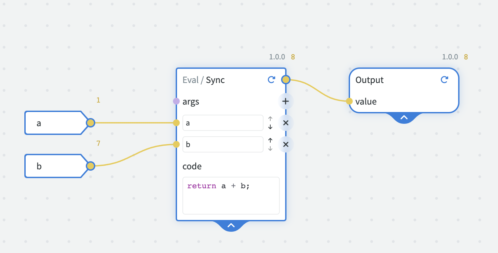
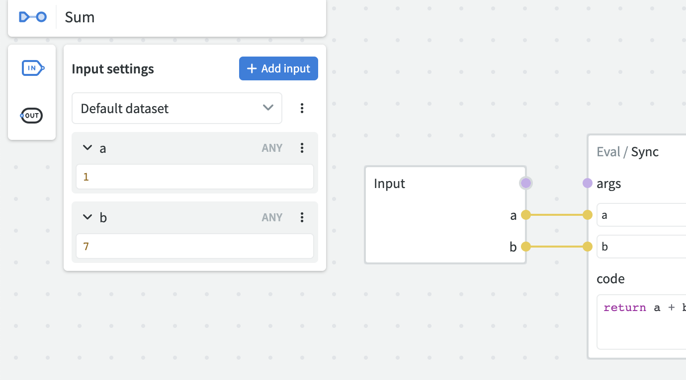
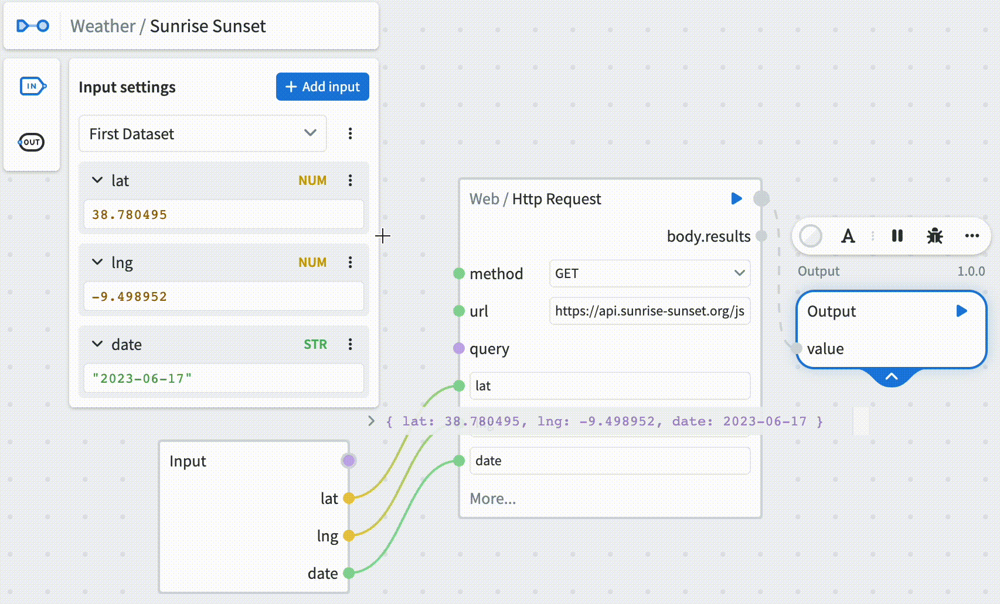

# Nodes

Nodes are the basic building blocks of a graph. A node on its own is comparable to a function and can be connected to each other using their _sockets_ to put together more complex logic.

Each node performs some logic to produce an output. Most nodes also have inputs that determine the output (similar to _variables_). Consider a `Sum` node that adds two numbers together (two inputs, `1` + `7`), this would produce an output of `8`. These are represented by sockets on the Node itself, with inputs on the left and the output on the right.

The inputs can be identified by the shape (the triangle towards the right), and an output can be identified by the rounded corners. In this example, our node is `Eval` which allows us to write some JavaScript which processes our inputs.

## Types of Nodes

There are two types of Nodes that you should understand the difference of:

 - **Standard Library** - these nodes cannot have their behaviour changed, they are provided by NodeScript. They provide the foundation to build more complex graphs.
 - **Modules** - these are covered in more detail [here](./modules.md), but succinctly they are ways of calling other graphs that perform their own logic.

## Adding Nodes to a Graph

When you are editing a graph, press spacebar or right click to open a menu that shows all the nodes that you can add to the canvas. You can use the search function or scroll within the menu to find the node you'd like to add.

## Input nodes and datasets

An input node can be added from the top left of the canvas, by selecting the IN icon. The node type and value can be selected in this UI and then added to the graph as any other node. 

The function is set up so that you always have the same inputs (like 'a' and 'b') for all your datasets, but you can change their values however you want. Also, when you make a new dataset, it just copies the values from the last one you were working with, until you decide to change them.

This functionality essentially provides the capability to maintain consistent input parameters, such as 'a' and 'b' in our example, while enabling their values to be different. This feature not only makes it easier to change your data, but it also lets you save these different setups. So, it's a breeze to switch between different sets of data.

**For example**, let's say you're trying to find out the sunset and sunrise times for specific locations, like Lisbon and London. You would use latitude and longitude as your inputs. You can save the latitude and longitude for Lisbon in one set, we'll call this 'Dataset 1'. Then, you can save the latitude and longitude for London in another set, which we'll call 'Dataset 2'.

This way, you don't need to keep looking up and copying the coordinates for these places each time you want to check the sunset and sunrise times. You just switch between 'Dataset 1' for Lisbon and 'Dataset 2' for London, and the system uses the right coordinates automatically.

