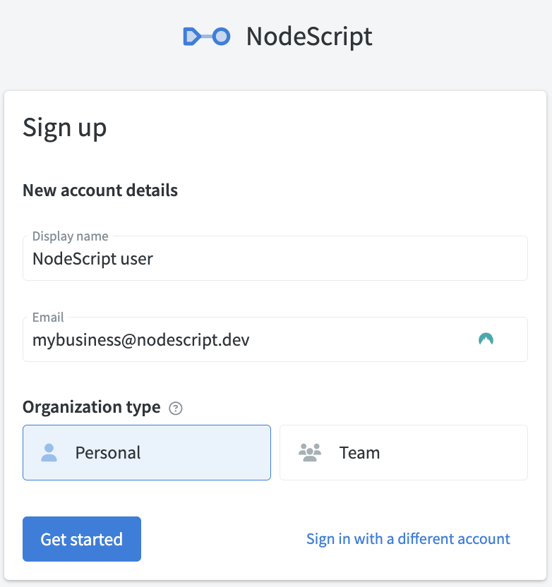

# Organisations

Organisatons are isolated spaces where you can add multiple `workspaces` and `members` in NodeScript. An organsiation acts as a billing entity as any credits assigned to your account are assigned to an organisation and used across all `workspaces` within it.

Only the members of a organisation have access to the `workspaces`, `endpoints` and `graphs` within it, content can not be shared across organisations.

## Adding an new Organisation

When you first sign up for NodeScript are prompted to choose your organisation type, either a `Personal` or a `Team`. This setting can be changed at any time in the organsiation settings. 

As their names suggest, a personal orgnaisation is for a single user and a team or allows for multiple team members to be added. 

### Adding additional organisation
A new Organisation can be added at any time by selecting `Add new` from the organisation dropdown menu in the NavBar.

(more setup info to come)

## Inviting new members

It's easy to add your friends (or colleagues) to your Organisation in NodeScript. It's only tricky when they don't already have an account - but they can sort that out easily; they just need to sign up.

Use Organsisation `Settings` by clicking on the cog next to the org name, click through to `Members`, press `Add Member` and enter their username.

## Managing your organisation

Everything asign to the currently selected organisation can be handled in the settings page. To access it click the cog on located next to the org name in the nav bar. 

### Workspaces
This will list all existing [workspaces](./workspaces.md) within your organisation, clicking one will take you directly to the workspace dashboard. 

You can added new workspaces to the org by selected `Create new workspace` and giving it a name.

### Members
View, add or remove all members of your workspace. User rights can also be assign on this page.

### Settings
Here you can change name and type of the organisation. 

### Billing

Coming soon

 

 

