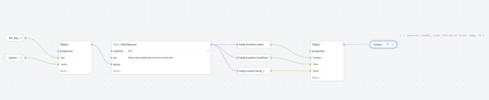

# Tutorials

## Building Your First Graph 

Welcome to your first NodeScript journey! In this tutorial, we'll walk you through creating a simple NodeScript graph that fetches and presents weather data using a GET request. This will help you get familiar with NodeScript's interface and node connections.

Ensure you're logged into [NodeScript](https://nodescript.dev/) before you begin.

### Step 1: Get an API Key

To fetch weather data, you need an API key from a weather API provider. There are several to choose from, like WeatherAPI or Weatherbit. For this tutorial, we'll use [WeatherAPI](https://www.weatherapi.com/signup.aspx). Just follow their instructions to sign up for a free API key.

### Step 2: Create a New Workspace

Navigate to the NodeScript dashboard and select your username from the SidePanel on the screen's left side. Then, click on "Create Workspace" from the menu and name this workspace "WeatherBot".

### Step 3: Create a New Graph

Inside your "WeatherBot" workspace, click on "New Graph" at the top. A new graph will appear - go ahead and rename it to "WeatherAPICall".

### Step 4: Store Your API Key as a Variable

Click on the icon next to your graph's title, to navigatge to the dashboard, and select "Variables" from the menu. 

Once there, add a new variable. Name it "API_KEY" and put your WeatherAPI key in the "Value" field.

### Step 5: Set up the inputs for the GET request

Now, navigate back to your graph, right click on the canva, select “Variable” from the menu and add your newly created API_KEY variable. This will authorize our API call when we make our GET request.

Next, add an “New input” node to your graph and label it “Query”. Select the cog symbol on the new input, set the type to STRING and add a location to the default input, for our tutorial we will use “London”.

We want to combine our Query and Key into a single input for our request. To do this add an "Object" node to the graph. Give it two properties named "Key" and "Query". Then, connect the nodes to their corresponding links.

### Step 6: Make the GET request:

- Add a “Web/HTTP Request” node to your graph.
- Select “GET” from the “Method” drop menu.
- Add “https://api.weatherapi.com/v1/current.json” to the URL text box.
- Select “more” from the bottom of the node and select the “Query” option.
- Now, connect your previously created object to the Query input and press play!

Now we have successfully made an API call and we can see the results in JSON format above the Request node. However, we don't want all of this data, we want to filter it to just the important parts to our user. 

Thankfully NodeScript has a handy feature to help you do that quick and painlessly…

### Step 7: Filter the JSON Data

The API call will return a JSON response. However, we only need certain bits of this data. To extract those, expand the JSON response by clicking the downward arrow. Drag the "Name", "localtime", and "temp_c" values from the "Body" to the canvas.

### Step 8: Create the Output

Last but not least, gather all the values together and create an output. Add an "Object" node with properties for each value extracted from the JSON and connect them accordingly. Create an "Output" node and connect your object to it. 

Hit play again, and voila! You now have the location, time, and temperature based on the default value entered in your "Query" node.

Feel free to play around by changing the default value in your "Query" to see weather data for other locations!

Now that you've built your first NodeScript graph, you're ready to take on more complex workflows. Happy NodeScripting!

## Creating Advance Workflows

Great job on creating your first graph with NodeScript! In this advanced tutorial, we'll take it a step further by building a Weather Forecast Bot. It will provide weather forecasts for different times and places, all retrieved via API calls.

Before we start, ensure you're logged into [NodeScript](https://nodescript.dev/) and have your WeatherAPI key ready.

### Step 1: Set Up Your Workspace and Graph

If you haven't already, create a new workspace called "AdvancedWeatherBot". In this workspace, create a new graph named "ForecastAPICall".

### Step 2: Store Your API Key

In the Variables section (which you can access from the icon next to your graph's title), create a new variable named "API_KEY". Enter your WeatherAPI key as the value.

### Step 3: Create Your GET Request Inputs

Return to your graph and add two input nodes. Name one "Query" (the location) and the other "Days" (the forecast length). For the "Query" node, set the type to "STRING" and use "London" as the default input. For the "Days" node, set the type to "NUMBER" and use "3" as the default input.

Now, add an "Object" node with properties called "Key", "Query", and "Days". Connect the corresponding nodes to these properties.

### Step 4: Fetch the Forecast

Add a "Web/HTTP Request" node and set "GET" as the method. Enter "https://api.weatherapi.com/v1/forecast.json" into the URL field. Click on "more" at the bottom of the node and select the "Query" option. Connect your Object node to this input.

Press play, and the API call will return a JSON response with forecast data for the next few days in London.

### Step 5: Filter the Data

Expand the JSON response and find the "forecastday" array, which contains a forecast for each day. For each day, we want the "date", "avgtemp_c", and "condition:text" values.

Add a "Map" node and connect the "forecastday" value from the JSON to the "Array" input. Inside the Map node's "Function" input, create an "Object" node with "date", "avgtemp", and "condition" properties. 

### Step 6: Create the Output

Connect the values mentioned above (from inside the Map node) to the corresponding properties in the Object node. Then, create an "Output" node, and connect the Map node to it.

Press play, and there you have it! You'll see the average temperature and weather condition for the next few days in your chosen location.

Play around with different values for "Query" and "Days". You'll see that your Weather Forecast Bot can provide forecasts for any location and any number of days you want. That's the power of NodeScript and your creativity combined! Keep exploring and see what else you can build.
