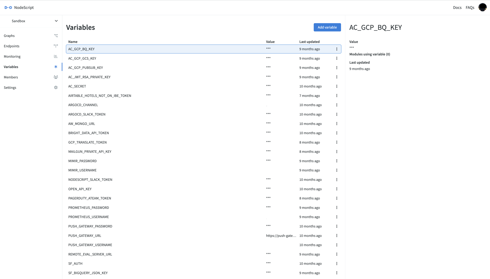

# Variables

You can view your variables using the workspace navigation. A new workspace doesn't have any variables to begin with, so you'll need to create them if you need them. You might not need them at first, but you will probably run into a situation where variables come in handy pretty quickly.

Variables are _scoped_ to the workspace they exist in - you cannot use these variables in other workspaces and other workspaces cannot use variables in your workspace.

To create a new variable, press the `Add Variable` button. The window will allow you to give it a name. Remember that workspaces do not share variables, which may help when deciding a name. For example, we may have an API Key to integrate with the Stripe API. We could call our variable `STRIPE_API_KEY`. There's no hard rules for your casing on variable names, but an uppercase name is similar to environment variable names for _actual code_ application that we write, so we'll stay close to that.

Because this is a sensitive variable (we want it to be encrypted when saved and masked in the UI when consuming it), we should make sure that the `Sensitive` toggle is ON. If we're adding a variable that isn't sensitive, one we want to read when editing our graphs (for example the Stripe base URL), we would simply turn off the sensitive toggle.

The value of sensitive variables cannot be read back, only updated. If you generate keys with other systems, be sure to store them somewhere secure in case you need to change your variable name in the future. ***Remember that once you create a variable, you cannot rename it, but you can add more.***
