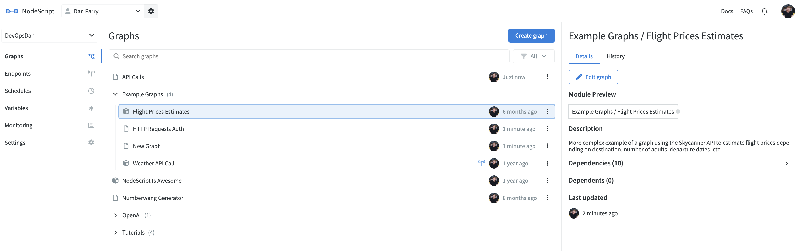

# Workspaces

Workspaces are isolated spaces where you can create `graphs` and `endpoints`. You can create `variables` (either sensitive or non sensitive strings) which can then be used within your graphs by plugging them into your `nodes`.

To create a new workspace, in the sidebar, select the drop down for the workspace you are currently in and press the `Create Workspace` button. Give your workspace a name and create it. Simple. This can also be done from the organsiations settings, workspaces page. 

## Managing Graphs 

In the same way an organization can contain multiple workspaces, a workspace can contain many graphs, in fact. They are all displayed on the `Graphs` page, accessed by selecting `Graphs` from the sidebar.

The center container will display a list of all graphs created within this workspace. This list is organized alphabetically by default but can be filtered by type or by a text search. Double-click on a graph to open it, or right-click it to open the action row menu. This menu can also be accessed by selecting the menu button located at the end of the list item.

### Folders and naming conventions

Graphs can be further organized into folders in NodeScript by adding a `/` to the graph's name.

For example, naming a graph "My graphs/Graph A", will create a folder in the graphs list containing 'Graph A'. All subsequent graphs with "My graphs/" will be added to this folder.

For this reason, avoid using this syntax in graph names that are not meant to create folders. For example, the date 01/03/2024 would unintentionally create nested folders, which might not be desirable.

## Managing endpoints

You can find all your endpoints in the Endpoints sidebar. Endpoints can be very powerful and flexible, as you can see here. Before relying on NodeScript for production applications, take some time to plan out your endpoints carefully.

## Workspace settings

In the settings tab you can change your workspace name or change its type. There are two types of workspaces with NodeScript:

* Default: Your standard environment where you create and manage your projects.
* Library: This workspace is used to share its published [modules](./modules.md). These modules can then be imported and used in graphs that are part of other workspaces. 

So, the main difference lies in the ability to share and reuse components from a library workspace across different projects and workspaces.

You can also add a description to or permanently delete a workspace from the settings menu.