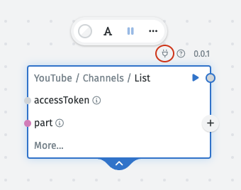
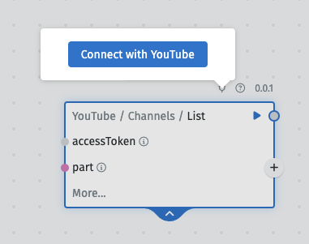

# App Connections

App Connections enable you to connect to third party services such as Slack, Google Sheets, YouTube, X, etc. that require an OAuth access token to call their API. If a refresh token is provided in the authentication process, the access token will be automatically updated using the refresh token.

You are able to create app connections in the following ways:

## Graph Editor

When you select a library from the library menu, if an App Connection Template is already available for that library, you will see a "plug" sign in the toolbar.

Select this, and click the button "Connect with Application":

You'll be redirected to the application's OAuth page to authenticate.

Once this is complete, you'll be redirected back to the graph, and a variable with the access token has been automatically created and connectected to the module interected with.

You're able to access this App Connection in the hub. Where if needed, you can edit information such as "Client ID", "Client Secret", "Name", etc, if you chose to do so.

## App Connections in hub

TODO - cvs - add screenshot here

### Custom App Connections

### Create App Connection from Template

TODO - mention about "hybrid connections here"

## Automatic Refresh Token 

When you create an App Connection with a "Grant Type" of [Authorizatio Code](https://www.oauth.com/oauth2-servers/access-tokens/authorization-code-request/) a "Refresh Token" will be available after authentication.

Within NodeScript we use this refresh token to automatically refresh the access token related to that app connection, so the senstive variable that holds this encrypted data, is available for you to use within endpoints and schedules, without the need to manually re-authenticate.

