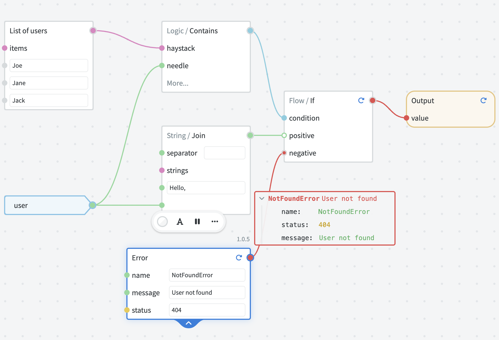
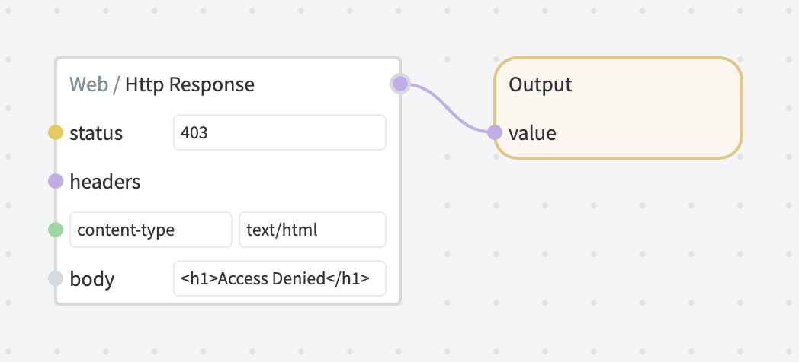

# Endpoints

When graphs are exposed as HTTP endpoints, NodeScript Platform will automatically provision server-side infrastructure for running a graph as a miniature HTTP server.

This process includes:

- Compiling and bundling a graph with all its dependencies into a single ESM module.
- Parsing incoming HTTP requests and converting them into graph inputs.
- Obtaining decrypted variables required by the graph and passing them to graph inputs.
- Invoking the compiled bundle and capturing the output.
- Converting the output into HTTP response.
- Capturing the sample data for monitoring.

## Request parameters

The following request data becomes available as inputs (in order of preference):

- **Path parameters**, specified in Endpoint path in curly braces, e.g. `/add/{a}/{b}` captures inputs `a` and `b` from request URL.

- **Query parameters** (or search parameters) — can be used with any request type by appending query string to request URL, e.g.`?a=42&b=54`. The parameters must be [URL-encoded](https://en.wikipedia.org/wiki/Percent-encoding) by clients; decoding happens automatically by NodeScript runtime.

- **Body parameters** sent by clients using either `application/json` or `application/x-www-form-urlencoded` content types. Only applicable to POST, PUT and PATCH requests.

Additionally, a special `$request` input is available for accessing all request details including headers, original URL, method, query parameters and body.

## Error handling

Errors thrown by graphs are automatically converted into JSON representation with `name` and `message` fields.

```json
{
    "name": "ValidationError",
    "message": "string validation failed: - must be an allowed value"
}
```

The numeric `status` field, if present on the error object, becomes the status code of the response. By default, 500 status code is used.

You can use Error node together with flow control nodes (such as Flow / If) to return custom response codes depending on some condition.



## Response format

The content type of HTTP response is inferred from the type of Output value:

- If the value is a <span style="color: var(--color-type-string-alt)">string</span>, the `text/plain` content type is used and the string is returned as is.
- If the value is `null` or `undefined`.
- Otherwise, the value is converted to JSON and `application/json` content type is used.

You can also use an Http / Response node to construct a custom response, for example if you need to set a custom content type or other headers.


