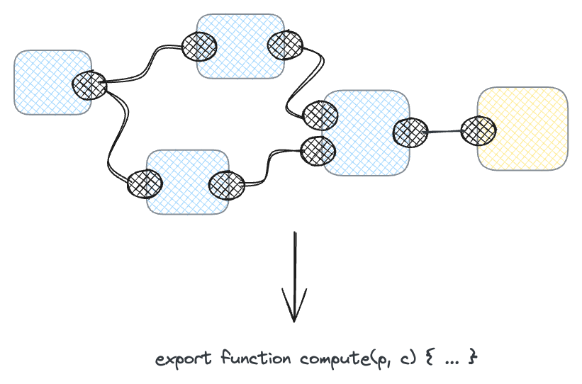
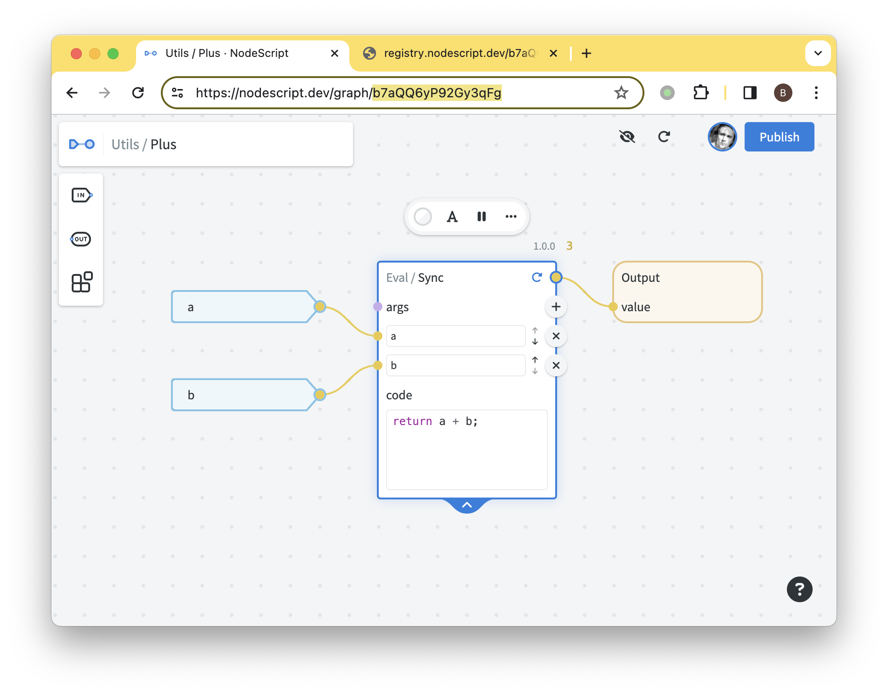
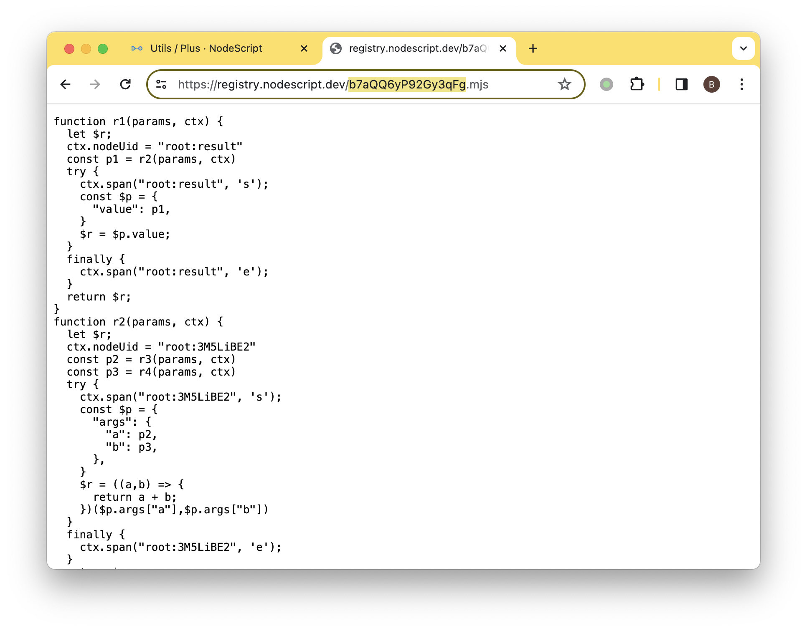
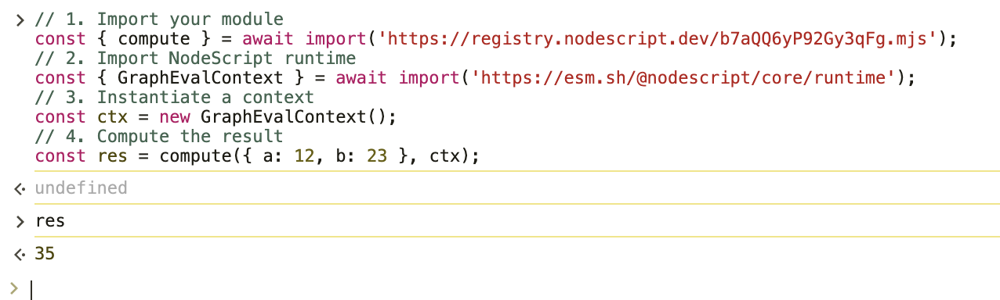
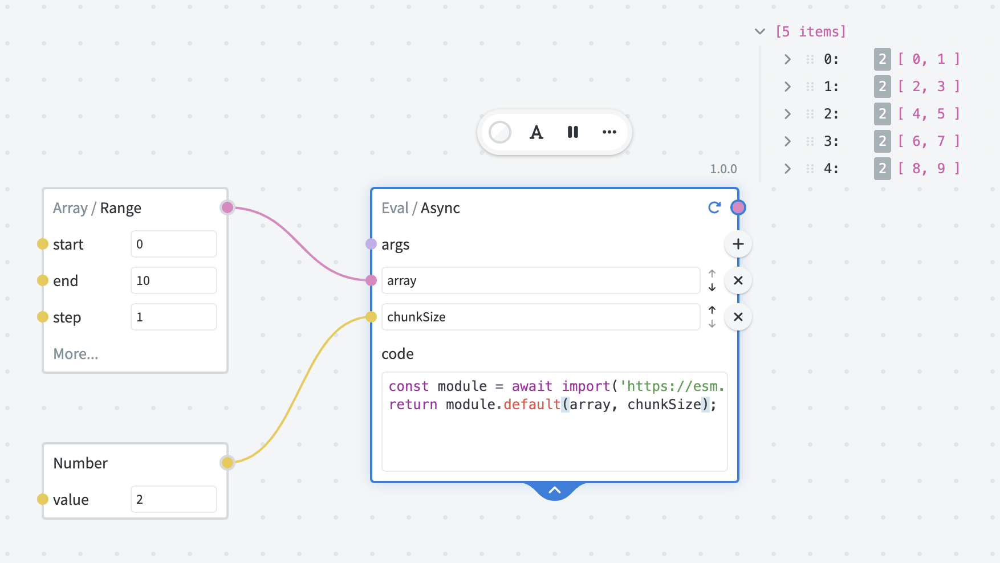

# Modules

In order to be evaluated, a graph must first be compiled into an [EcmaScript module](https://developer.mozilla.org/en-US/docs/Web/JavaScript/Guide/Modules).

Compiler is a program (part of the [Open Source NodeScript Core](https://github.com/NodeScriptLang/core/tree/main/src/main/compiler)) that takes a graph as a logical set of interconnected nodes and transforms it into the JavaScript code that machines can interpret and execute.



Because of this architecture, the programs created in NodeScript have comparable performance characteristics to the "real" code written by programmers. NodeScript only adds a minimal overhead related to tracing, type conversion and error handling.

The compiling process itself is super fast. In fact, the graph is re-compiled every time you make a change in the editor.

## Registry

When the graph is published, its compiled version becomes **publicly available** in NodeScript Registry.

A quick way to access the compiled module is to copy the Graph Id from the URL and visit `https://registry.nodescript.dev/<graphId>.mjs`.





The other graphs can then import the compiled module from the Registry and use it.

<p class="note">
The compiled code of published graphs should be treated as <strong>public domain</strong>.
For this reason, you should <strong>never publish graphs with hardcoded secrets</strong> — always store your secrets in encrypted variables.
</p>

## Running modules

You can run modules in any modern ESM environment, for example:

- In any [recent version](https://caniuse.com/?search=es%20module) of Google Chrome, Apple Safari, Mozilla Firefox, Microsoft Edge or Opera.
- In Node.js v. 20 with `--experimental-network-imports` flag.

For example, you can run the following in the DevTools console of your browser:

```js
// 1. Import your module
const { compute } = await import('https://registry.nodescript.dev/b7aQQ6yP92Gy3qFg.mjs');
// 2. Import NodeScript runtime
const { GraphEvalContext } = await import('https://esm.sh/@nodescript/core/runtime');
// 3. Instantiate a context
const ctx = new GraphEvalContext();
// 4. Compute the result (note: you do not need `await` if the module is synchronous)
const res = await compute({ a: 12, b: 23 }, ctx);
// -> 35
```



## Sync vs. Async

Compiler performs multiple optimizations based on the structure of the graph. One such important optimization is determining whether the graph is synchronous or asynchronous.

In JavaScript, certain operations like I/O or waiting require asynchronous execution. In modern environments those are encapsulated using [async/await](https://developer.mozilla.org/en-US/docs/Web/JavaScript/Reference/Statements/async_function) and [Promises](https://developer.mozilla.org/en-US/docs/Web/JavaScript/Reference/Global_Objects/Promise). However, for synchronous operations (e.g. like simple computations in our example above) async/await adds considerable performance overhead and should be avoided.

NodeScript compiler will automatically make modules asynchronous if there are asynchronous nodes in the graph. Thus, when creating modules with custom code nodes, pay attention to choosing an appropriate version of Eval node. Specifically,

- Use Eval / Async if you need to work with asynchronous code (this includes but not limited to Fetch API, Web Crypto and any use case requiring Promise).

- For any other use case, prefer Eval / Sync.

## Interoperability with libraries

A lot of modern JavaScript libraries are built with modern ESM runtimes in mind and thus will either have native ESM builds readily available, or can be converted to ESM format using [esm.sh](https://esm.sh). Such libraries will generally work just fine in NodeScript — just use `Eval / Async` node and use `await import()` to make them available in your code.

For example, all <a>Lodash</a> modules work fine in NodeScript.



The general rule of thumb for compatibility is: if it works both in the browser and in Node.js environments using `await import`, there's a big chance it will also work in NodeScript.

That being said, unfortunately, there is still no guarantee. Even though the ESM standard is mature and widely adopted, a lot of community-maintained libraries would still use older standards like CommonJS or UMD — those will not work out of box.

## Runtime restrictions

When writing custom code or using a library, it's important to keep in mind the differences between the browser runtime and the backend runtime used for running the endpoints and schedules.

<p class="note">
If you never intend your modules to execute on the backend, you can use any APIs available in your browser. For example, it is possible to access local file systems using <a href="https://developer.mozilla.org/en-US/docs/Web/API/File_System_API" target="_blank">File System APIs</a> if you wish to automate something locally.<br/>
However, if you wish to make modules that work both in the editor and on the backend, you need to stick with the restricted runtime as described below.
</p>

Available global objects and functions:

- [Standard JavaScript built-ins](https://developer.mozilla.org/en-US/docs/Web/JavaScript/Reference/Global_Objects), including `Array`, `Date`, `RegExp`, `Promise`, `Set`, `Map`, `Intl`, typed arrays, etc.

- timer functions: `setTimeout`, `setInterval`, `setImmediate`, `clearTimeout`, `clearInterval`, `clearImmediate`

- [Web Crypto API](https://developer.mozilla.org/en-US/docs/Web/API/Web_Crypto_API) via `crypto.subtle`

- [Fetch API](https://developer.mozilla.org/en-US/docs/Web/API/Fetch_API) via `fetch`, `FormData`, etc

- [URL](https://developer.mozilla.org/en-US/docs/Web/API/URL) and [URLSearchParams](https://developer.mozilla.org/en-US/docs/Web/API/URLSearchParams)

Restricted APIs:

- [console](https://developer.mozilla.org/en-US/docs/Web/API/console) — only available in the browser. Publishing code with `console` will not break, but will not emit any logs, so generally not recommended.
