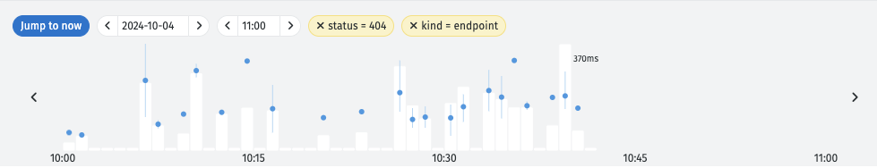

# Monitoring

When modules are used in [endpoints](https://docs.nodescript.dev/guide/endpoints) and schedules, they run automatically. By default, you won't be able to see the results of that running instance as you would if you had run the graph manually.

Instead, you can view the results of all the running instances of your modules on the Monitoring page:

**Log Indicators**

Each log entry displays an icon to indicate its type on the left-hand side:

* Schedule: <svg xmlns="http://www.w3.org/2000/svg" height="16" width="16" viewBox="0 0 512 512"><!--!Font Awesome Free 6.6.0 by @fontawesome - https://fontawesome.com License - https://fontawesome.com/license/free Copyright 2024 Fonticons, Inc.--><path fill="#74C0FC" d="M464 256A208 208 0 1 1 48 256a208 208 0 1 1 416 0zM0 256a256 256 0 1 0 512 0A256 256 0 1 0 0 256zM232 120l0 136c0 8 4 15.5 10.7 20l96 64c11 7.4 25.9 4.4 33.3-6.7s4.4-25.9-6.7-33.3L280 243.2 280 120c0-13.3-10.7-24-24-24s-24 10.7-24 24z"/></svg>

* Endpoint: <svg xmlns="http://www.w3.org/2000/svg" height="16" width="16" viewBox="0 0 576 512"><!--!Font Awesome Free 6.6.0 by @fontawesome - https://fontawesome.com License - https://fontawesome.com/license/free Copyright 2024 Fonticons, Inc.--><path fill="#74C0FC" d="M80.3 44C69.8 69.9 64 98.2 64 128s5.8 58.1 16.3 84c6.6 16.4-1.3 35-17.7 41.7s-35-1.3-41.7-17.7C7.4 202.6 0 166.1 0 128S7.4 53.4 20.9 20C27.6 3.6 46.2-4.3 62.6 2.3S86.9 27.6 80.3 44zM555.1 20C568.6 53.4 576 89.9 576 128s-7.4 74.6-20.9 108c-6.6 16.4-25.3 24.3-41.7 17.7S489.1 228.4 495.7 212c10.5-25.9 16.3-54.2 16.3-84s-5.8-58.1-16.3-84C489.1 27.6 497 9 513.4 2.3s35 1.3 41.7 17.7zM352 128c0 23.7-12.9 44.4-32 55.4L320 480c0 17.7-14.3 32-32 32s-32-14.3-32-32l0-296.6c-19.1-11.1-32-31.7-32-55.4c0-35.3 28.7-64 64-64s64 28.7 64 64zM170.6 76.8C163.8 92.4 160 109.7 160 128s3.8 35.6 10.6 51.2c7.1 16.2-.3 35.1-16.5 42.1s-35.1-.3-42.1-16.5c-10.3-23.6-16-49.6-16-76.8s5.7-53.2 16-76.8c7.1-16.2 25.9-23.6 42.1-16.5s23.6 25.9 16.5 42.1zM464 51.2c10.3 23.6 16 49.6 16 76.8s-5.7 53.2-16 76.8c-7.1 16.2-25.9 23.6-42.1 16.5s-23.6-25.9-16.5-42.1c6.8-15.6 10.6-32.9 10.6-51.2s-3.8-35.6-10.6-51.2c-7.1-16.2 .3-35.1 16.5-42.1s35.1 .3 42.1 16.5z"/></svg>

On the right hand side, for each instance you are able to see:

* Status, e.g. `200`
* Amount of times it has run, e.g. `3x`
* Latency, e.g. `234ms`

The log samples have a granularity of minutes, which you'll be able to see for 10 days.
    
After this time, you'll still be able to access back the logs using the arrows, but the logs will have an hourly granularity.

**Filtering**

You are able to filter the logs in the Monitoring page.

To filter by type, in one of the logs, click on its icon: either a schedule:
<svg xmlns="http://www.w3.org/2000/svg" height="12" width="12" viewBox="0 0 512 512"><!--!Font Awesome Free 6.6.0 by @fontawesome - https://fontawesome.com License - https://fontawesome.com/license/free Copyright 2024 Fonticons, Inc.--><path fill="#74C0FC" d="M464 256A208 208 0 1 1 48 256a208 208 0 1 1 416 0zM0 256a256 256 0 1 0 512 0A256 256 0 1 0 0 256zM232 120l0 136c0 8 4 15.5 10.7 20l96 64c11 7.4 25.9 4.4 33.3-6.7s4.4-25.9-6.7-33.3L280 243.2 280 120c0-13.3-10.7-24-24-24s-24 10.7-24 24z"/></svg>
 or endpoint:
 <svg xmlns="http://www.w3.org/2000/svg" height="12" width="12" viewBox="0 0 576 512"><!--!Font Awesome Free 6.6.0 by @fontawesome - https://fontawesome.com License - https://fontawesome.com/license/free Copyright 2024 Fonticons, Inc.--><path fill="#74C0FC" d="M80.3 44C69.8 69.9 64 98.2 64 128s5.8 58.1 16.3 84c6.6 16.4-1.3 35-17.7 41.7s-35-1.3-41.7-17.7C7.4 202.6 0 166.1 0 128S7.4 53.4 20.9 20C27.6 3.6 46.2-4.3 62.6 2.3S86.9 27.6 80.3 44zM555.1 20C568.6 53.4 576 89.9 576 128s-7.4 74.6-20.9 108c-6.6 16.4-25.3 24.3-41.7 17.7S489.1 228.4 495.7 212c10.5-25.9 16.3-54.2 16.3-84s-5.8-58.1-16.3-84C489.1 27.6 497 9 513.4 2.3s35 1.3 41.7 17.7zM352 128c0 23.7-12.9 44.4-32 55.4L320 480c0 17.7-14.3 32-32 32s-32-14.3-32-32l0-296.6c-19.1-11.1-32-31.7-32-55.4c0-35.3 28.7-64 64-64s64 28.7 64 64zM170.6 76.8C163.8 92.4 160 109.7 160 128s3.8 35.6 10.6 51.2c7.1 16.2-.3 35.1-16.5 42.1s-35.1-.3-42.1-16.5c-10.3-23.6-16-49.6-16-76.8s5.7-53.2 16-76.8c7.1-16.2 25.9-23.6 42.1-16.5s23.6 25.9 16.5 42.1zM464 51.2c10.3 23.6 16 49.6 16 76.8s-5.7 53.2-16 76.8c-7.1 16.2-25.9 23.6-42.1 16.5s-23.6-25.9-16.5-42.1c6.8-15.6 10.6-32.9 10.6-51.2s-3.8-35.6-10.6-51.2c-7.1-16.2 .3-35.1 16.5-42.1s35.1 .3 42.1 16.5z"/></svg>
 
 And to filter by status, e.g. `404` or `200` simply click in the status.

You should see something similar to the below:

This can aid you in finding particular errors or warnings that may have occurred for a particular type of log instance.

**Identifying Errors**

By clicking on each log, you can expand it to see the error messages more clearly:

