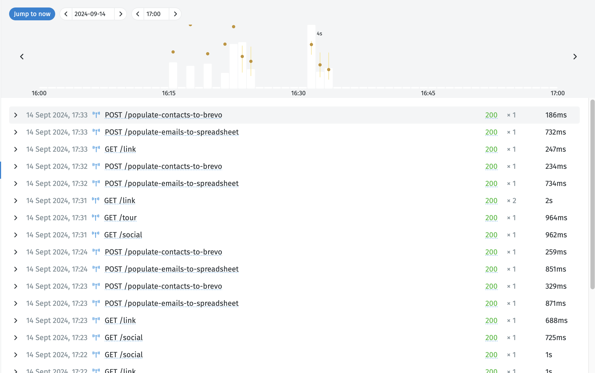
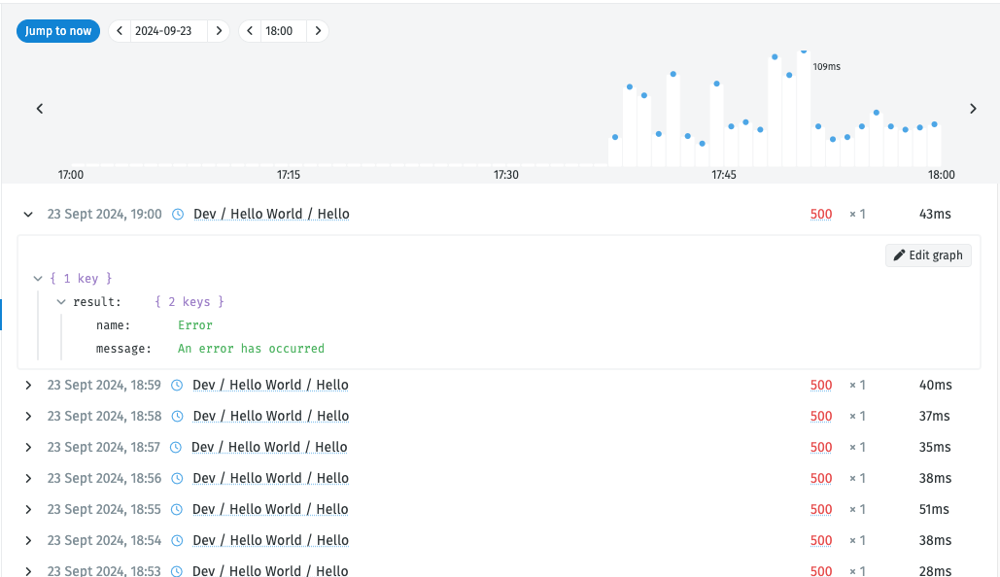

# Monitoring

When modules are used in [endpoints](https://docs.nodescript.dev/guide/endpoints) and schedules, it means they are run automatically, so by default, you'll not be able to see the results of that running instance, as you would if you had ran that graph manually.

Instead, you can view the results of all the running instances of your modules in the monitoring page.

In each of the above logs, you are able to see if they are a schedule:

TODO - add screesshot here

Or an endpoint

TODO - add screenshot here

## Filtering

By clicking in the icons or statuses, you are able to filter the logs in the monitoring page.

This can aid you in finding particular errors or warnings that may have ocurred.

## Errors

By clicking on each log you are able to expand these, and see the error messages:

