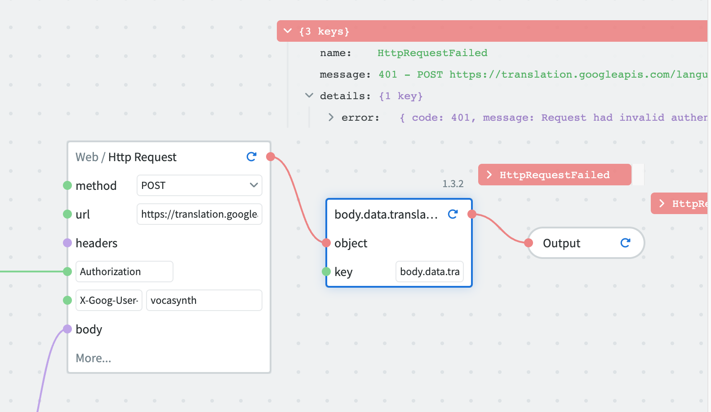
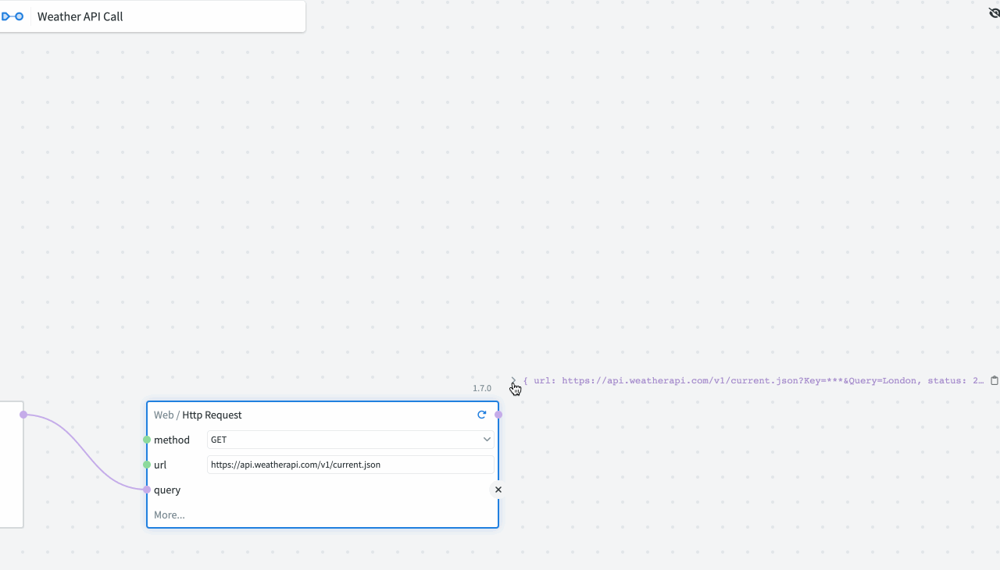

# NodeScript FAQs

### How do I connect my NodeScript graphs to existing services?
By creating and publishing an Endpoint. 

When you publish an endpoint, it becomes available to be called by other systems and services.

There are two ways to publish an endpoint:

* From your graph - when you publish a graph, you'll be given the option to expose it via HTTP and select a method and URL.
* From the endpoints page. This gives you a more powerful way of customising your endpoint and also displays all the endpoints for your workspace together in one place.

___

### What types of systems and services can NodeScript connect with?
Any platform with an API.

NodeScript can also connect to Mongo via your standard connection string. 

___

### What is the known limit of NodeScript graphs?
Currently there is no limit to the amount of nodes you can add to a graph, there is a computational limit to NodeScript, but we have yet to find it...

___

### What are some typical use cases for NodeScript?

* Connecting two API services. 
* Creating Slack integration.
* Data manipulation, transformation and filtering. 

___

### How can I share my NodeScript graphs with other team members?
You can give team members access to graphs by inviting them to join the workspace the graph is in. If you and a team member are both members of the same space, you can simply share the URL.  

___

### What is the difference between saving and publishing a graph?

Both saved and published graphs can be accessed and edited by any user with access to the workspace it is in. Only published graphs however can be used in the outside world, connected to other services, or called in other graphs.

Graphs save automatically, but are published manually.

You can also change the visibility of published graphs to private or public.
* Private - modules can only be viewed by users in the workspace.
* Public - modules can be viewed by anyone in the NodeScript community.

___

### What measures are in place to ensure the security of my NodeScript graphs?

User control and access to graphs is handled on a workspace basis.

NodeScript does not store user information in anyway other than the user generated graphs and variables. Login with GitHub only requires the user's email as authentication.

?If you are using our Cloud Services, all variables are secured?

Variables are encrypted.

___

### How can I provide feedback or report bugs about NodeScript?

You can email us at support@nodescript.com or fill in our **feedback form.**

___

### Will NodeScript be integrated with other coding languages in the future?
Nope.

___

### Are there any limits on the number of nodes I can add to my graph?
Nope.

___

### Can I schedule my NodeScript graphs to run at specific times?
We will be adding chrono triggers in the coming months.

___

### How do I manage user permissions in NodeScript?

Currently you can manage access by either inviting or removing users from workspaces.
We will be adding users rights and management options to NodeScript soon.

An admin level user can manage the access level of users within their team.
___

### How can I track the execution and performance of my graphs in NodeScript?

...coming soon
___

### Can I use NodeScript for API testing and automation?

If you want to test a public API you call it with a Get request in NodeScript and see the result.

___

### How does error handling work in NodeScript?

The first and most obvious way to spot an error in NodeScript is by the connection between nodes. If a connection is broken or greyed out, then there is an error in the origin node.

NodeScript also provides an error response. If you make an unauthorised API request for example, an error message will appear to explain the nature of the error.

___

### Can I create reusable components or templates in NodeScript?

Published graphs/modules can be added as nodes to other graphs. 

Templates - in the sense of a pre-made or boilerplate graph cannot be created in NodeScript.

**The functionality of a published graph can be called as a node in another graph but a template cannot be created for reuse.**

___

### What kind of data formats can be processed by NodeScript?

JSON.

___

### How does NodeScript handle version control and collaboration?

Once a graph is published the version history will be stored in the graph list. Accessing a previous version will not override new versions of the same graph.

___

### I created a new graph, what next? what do I do first?

Right click on the canvas or hit the spacebar to add your first node.

Refer to our [First Graph Guide](./weather-bot.md) for more details.

___

### How does the graph work internally? 

We save node information individually, save these files to a database and call on them when needed.

Compiled, permanent URL, provide samples.

___

### What happens when I press the "publish" button?

The graph state is turned into a module and assigned a version number.Version control and history access are also made available.

Publish graphs can also be used for the creation of end points, called into other graphs or shared publicly.

___

### What do you mean "instant feedback"?

The output of a given node, or module, can be seen above its top right hand corner. This output updates whenever a change is made and the play (or refresh if previously ran) button is triggered.

Attributes of a JSON object can also be instantly accessed via the click and drag function. Whereas with conventional coding, the data would need to be filtered and manipulated, with NodeScript this is a single click.

