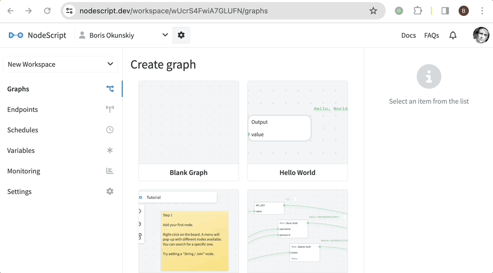
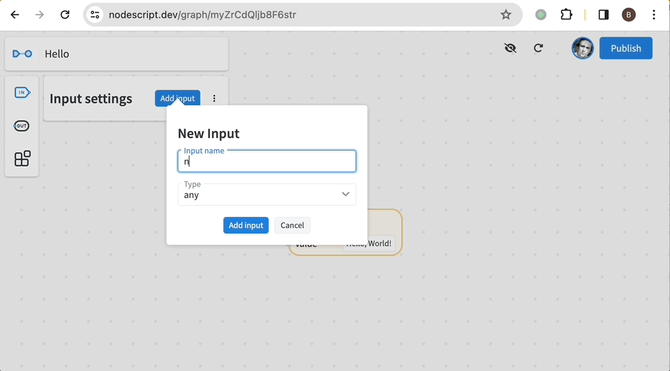
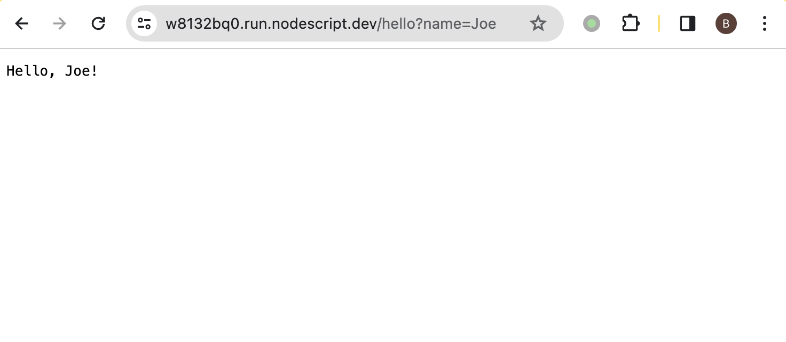

# Quick start

You are 5 minutes away from creating your first NodeScript endpoint.

## Sign up

First, you need a NodeScript Platform account. You can use one of the following methods for signing up:

- Login with Google (OAuth)
- Login with GitHub (OAuth)
- Magic link (the sign in link will be sent to your email)

## Organization

At the first sign in you will be prompted to create an organization.

In NodeScript everything you create is linked to a particular organization. This way you can add more people to collaborate with you.

If you don't need to add teammates yet, just proceed with a Personal organization — you can change this at any time in Organization settings.

## Workspace

Workspaces provide a way to structure your graphs, endpoints, schedules and variables. This becomes especially relevant when you build multiple applications with a single team.

You can create as many workspaces as you want in the organization; however, there are at least 3 things to consider when deciding whether you need a separate workspace:

- Published graphs automatically become the modules you can use in other graphs within the same workspace — but not in other workspaces.
- Variables (including encrypted secrets) are never accessible across workspaces.
- Logs and metrics are displayed separately for each workspace.

When you start out, you have a default workspace already pre-made, so let's use that.

## Create a graph

It's a [well established tradition](https://en.wikipedia.org/wiki/%22Hello,_World!%22_program) to teach computers to greet people with every new technology.

Let's do the same now.

- Go to "Graphs" and click <kbd>Create Graph</kbd>, set the graph name to "Hello".

- Right click on the canvas to bring up the Add Node menu, add the Output node.

- Type "Hello, World!" into the Output node's `value` field.

- Click <kbd>Publish</kbd> &rarr; "Expose via HTTP" &rarr; <kbd>Publish module</kbd>.

- Your endpoint is now ready! Click <kbd>Publish</kbd>, copy the URL and visit it in your browser.

## Adding an input

Without inputs our endpoint will always show us the same "Hello, World!" no matter what.

Let's make it a bit more interesting and introduce an input, so that it would greet a person with a specified name.

- Click the <kbd>Inputs</kbd> button &rarr; <kbd>Add input</kbd>.

- Specify `name` as input name &rarr; choose `string` as input type &rarr; <kbd>Add input</kbd>.

- Next, right-click on the canvas and add an Input "name" node. This node will hold the value of our input.

- With the Input node selected expand the input and type in a value (e.g. your name). Notice how this value appears as an outcome of the Input node.

- Time to assemble our greeting. There's a number of ways this can be done, but we'll go for String / Join for this demo:

    - Right-click &rarr; add String / Join.
    - Click <kbd>+</kbd> button next to `strings` — this will add another line where you can type text or connect the value of another node.
    - We need 3 such components overall, so click <kbd>+</kbd> two more times.
    - Now fill them in:
        1. type `Hello, ` into the first line
        2. plug the `name` node into the second line
        3. type `!` into the third line
    - Notice how the result of String / Join changes as you type and tweak the values accordingly.

- Now plug String / Join to the `value` of the Output node.

- Finally, click <kbd>Publish</kbd> and then <kbd>Publish module</kbd> one more time.

Now open your endpoint in the browser again, but this time add `?name=Joe` to the URL. The result should look like this:

---

Great job so far!

Make sure to check out our [bite-sized tutorials](./tutorials/README.md) to learn more NodeScript fundamentals.
